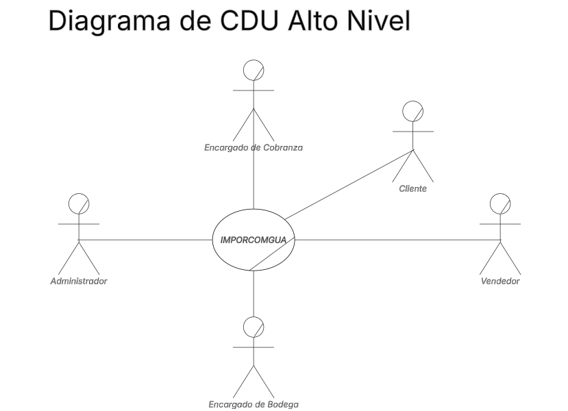
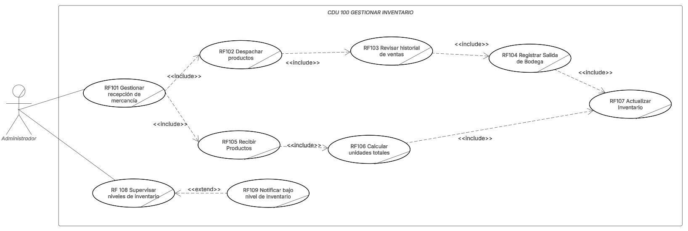
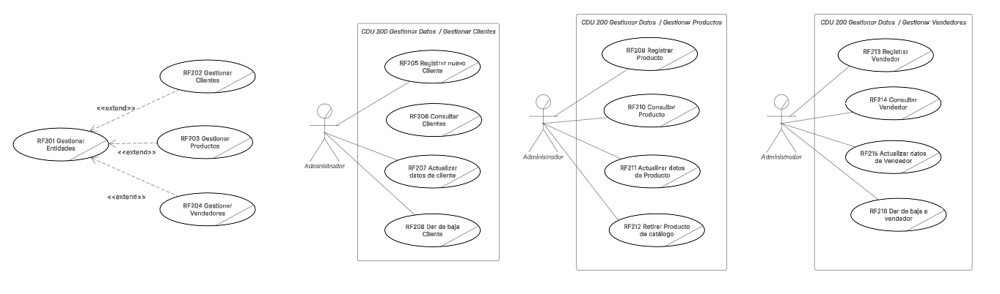
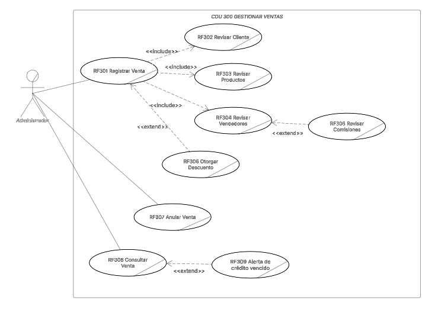
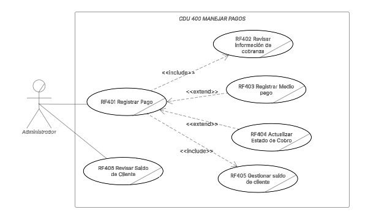
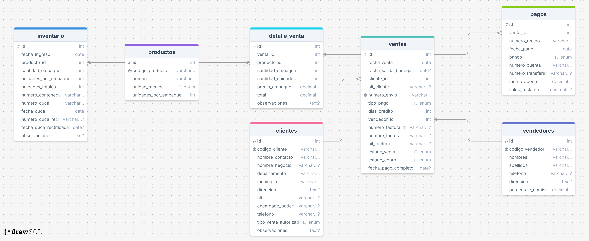

## AyD2 Proyecto único
## Documentación Grupo 1
# IMPORCOMGUA

## 1. Core de Negocio
### A. Descripción

IMPORCOMGUA busca digitalizar de extremo a extremo sus procesos, inventario, comisiones y cobranzas debido a que cuentan con mucha intervención manual, para asegurar que el producto correcto salga a tiempo, la factura se emita sin errores y el dinero ingrese puntualmente. La plataforma web propuesta centraliza la captura de datos, valida las reglas de negocio y expone reportes en tiempo real, de modo que Administrador, Vendedor, Bodeguero y Encargado de Cobranza trabajen sobre la misma fuente de datos. El flujo unificado abarca el mantenimiento de clientes, productos y vendedores. Las entradas / salidas de inventario, el registro de ventas con descuentos, el seguimiento de pagos y el cálculo automático de comisiones, complementado con alertas inteligentes (crédito vencido, stock crítico) que agilizan la toma de decisiones.

| Actor                     | Funciones                                                                                   |
|-------------------------|---------------------------------------------------------------------------------------------|
| **Cliente**             | Solicitar productos, autorizar tipo de pago, efectuar pagos.                                |
| **Vendedor**            | Registrar ventas, aplicar descuentos autorizados, consultar su comisión.                    |
| **Bodeguero**           | Confirmar ingresos DUCA, programar y despachar salidas de bodega.                           |
| **Administrador del sistema** | Gestionar maestros y usuarios, configurar reglas de negocio, emitir reportes.         |
| **Cobranza**            | Registrar abonos, monitorear saldos, disparar alertas de vencimiento.                       |

### B.1 Diagrama de CDU de Alto nivel

### B.2 Diagrama de CDU Primera descomposición

## 2. Drivers Arquitectónicos

## A. Requerimientos funcionales críticos

### Gestión de Inventario (CUN 100)
 El Administrador procesa cada ingreso de mercancía (DUCA), registrando contenedor, documento aduanero y cantidad en fardos/paquetes; el sistema convierte la cantidad a unidades, actualiza el saldo por producto y conserva un rastro histórico. El mismo módulo permite registrar salidas de bodega asociadas a la venta seleccionada y, cuando es necesario, consultar el historial de ventas relacionadas, registrar devoluciones o ajustes de stock y disparar una alerta automática cuando el inventario cae por debajo del umbral mínimo configurado.
### Gestión de Datos (CUN 200)
 El Administrador mantiene las entidades principales. Al crear Clientes se genera el código automáticamente combinando el prefijo de departamento y un correlativo; al crear Productos se fija una sola vez el número de “unidades por fardo/paquete”, valor que luego se reutiliza en inventario y ventas; al crear Vendedores se guarda un porcentaje de comisión que el sistema usará al liquidar las ventas. Cada entidad admite consultar, editar y eliminar.
### Gestión de Ventas (CUN 300)
 El vendedor registra la venta seleccionando cliente, productos y tipo de pago. La aplicación recupera el NIT del cliente, valida la disponibilidad en inventario, calcula totales en unidades y en quetzales y deja la venta en estado “Cobro pendiente”. Puede aplicar descuentos autorizados, anular la venta y, en fase de seguimiento, consultarla mediante filtros. Cuando la venta se liquida, el sistema calcula automáticamente la comisión del vendedor y genera alertas de “crédito vencido” si el plazo pactado expira sin pago.
### Manejo de Pagos (CUN 400)
 El Cliente rellena el formulario de pago y el Encargado de Cobranza registra abonos parciales o totales. Tras buscar la venta y mostrar su detalle, ingresa banco, número de recibo y monto; antes de confirmar el abono revisa la información de cobranza vigente y, en cualquier momento, puede consultar el saldo acumulado del cliente. El sistema actualiza el saldo residual, cambia el estado a “Parcial” o “Pagado” y, en este último caso, registra la fecha de cancelación definitiva. Cuando el saldo llega a cero, el sistema liquida la comisión correspondiente al vendedor.

## 3. Diagramas CDU Expandidos

### 3.1. Gestionar Inventario

#### 3.1.1. Descripción de casos de uso de CDU 100 Gestionar Inventario
| **Nombre**                     | **RF101 Gestionar recepción de mercancía**         |
|---------------------------------|--------------------------------------------|
| **Actores**                    | Administrador                              |
| **Propósito**                  | Gestionar la recepción de productos en el inventario. |
| **Resumen**                    | El caso de uso inicia cuando el Administrador recibe mercancía en el almacén. El proceso incluye verificar los productos recibidos, registrarlos en el sistema y asegurar que coincidan con el pedido. |
| **Flujo de trabajo**           | - Básico (normal)                          |
|                                 | 1. El Administrador recibe los productos en el almacén. |
|                                 | 2. El Administrador verifica que los productos coincidan con la orden de compra. |
|                                 | 3. El Administrador registra los productos recibidos en el sistema. |
|                                 | 4. El sistema actualiza el inventario con los productos recibidos. |
| **Prioridad**                  | Alta                                       |
| **Mejoras**                    | Implementar una validación automática de productos contra las órdenes de compra para asegurar la precisión en la recepción |

---

| **Nombre**                     | **RF102 Despachar productos**                    |
|---------------------------------|--------------------------------------------|
| **Actores**                    | Administrador                              |
| **Propósito**                  | Despachar productos a los clientes o a otras áreas de la empresa. |
| **Resumen**                    | El caso de uso inicia cuando el Administrador recibe una solicitud para despachar productos. El proceso incluye la verificación de existencia en el inventario y la actualización de registros. |
| **Flujo de trabajo**           | - Básico (normal)                          |
|                                 | 1. El Administrador recibe la solicitud para despachar productos. |
|                                 | 2. El Administrador verifica que los productos estén disponibles en el inventario. |
|                                 | 3. El Administrador despacha los productos solicitados. |
|                                 | 4. El sistema actualiza el inventario y registra la salida de productos. |
| **Prioridad**                  | Alta                                       |
| **Mejoras**                    | Implementar seguimiento de pedidos en tiempo real. |

---

| **Nombre**                     | **RF103 Revisar historial de ventas**            |
|---------------------------------|--------------------------------------------|
| **Actores**                    | Administrador                              |
| **Propósito**                  | Revisar el historial de ventas de productos en el sistema. |
| **Resumen**                    | El caso de uso inicia cuando el Administrador solicita ver el historial de ventas. El proceso permite obtener datos históricos de productos vendidos para análisis o reportes. |
| **Flujo de trabajo**           | - Básico (normal)                          |
|                                 | 1. El Administrador solicita revisar el historial de ventas. |
|                                 | 2. El sistema consulta los registros de ventas anteriores. |
|                                 | 3. El Administrador recibe el reporte de ventas. |
| **Prioridad**                  | Media                                      |
| **Mejoras**                    | Añadir filtros por fecha y producto. |

---

| **Nombre**                     | **RF104 Registrar salida de bodega**             |
|---------------------------------|--------------------------------------------|
| **Actores**                    | Administrador                              |
| **Propósito**                  | Registrar la salida de productos del inventario para su entrega o venta. |
| **Resumen**                    | El caso de uso inicia cuando el Administrador procesa la salida de productos. El sistema actualiza el inventario y registra la transacción. |
| **Flujo de trabajo**           | - Básico (normal)                          |
|                                 | 1. El Administrador recibe la solicitud para registrar la salida de productos. |
|                                 | 2. El Administrador verifica que los productos estén disponibles en el inventario. |
|                                 | 3. El Administrador registra la salida de los productos en el sistema. |
| **Prioridad**                  | Alta                                       |
| **Mejoras**                    | Implementar notificaciones de bajo stock. |

---

| **Nombre**                     | **RF105 Recibir productos**                     |
|---------------------------------|--------------------------------------------|
| **Actores**                    | Administrador                              |
| **Propósito**                  | Recibir y registrar productos que lleguen a la bodega. |
| **Resumen**                    | El caso de uso inicia cuando el Administrador recibe productos. El proceso incluye verificar los productos recibidos y actualizar el inventario. |
| **Flujo de trabajo**           | - Básico (normal)                          |
|                                 | 1. El Administrador recibe los productos. |
|                                 | 2. El Administrador verifica la cantidad y condición de los productos. |
|                                 | 3. El Administrador actualiza el inventario con los productos recibidos. |
| **Prioridad**                  | Alta                                       |
| **Mejoras**                    | Integrar escaneo automático para una mejor precisión. |

---

| **Nombre**                     | **RF106 Calcular unidades totales**             |
|---------------------------------|--------------------------------------------|
| **Actores**                    | Administrador                              |
| **Propósito**                  | Calcular el total de unidades de productos en inventario. |
| **Resumen**                    | El caso de uso inicia cuando el Administrador solicita calcular el total de unidades en inventario. El sistema realiza los cálculos y presenta el resultado. |
| **Flujo de trabajo**           | - Básico (normal)                          |
|                                 | 1. El Administrador solicita calcular el total de unidades. |
|                                 | 2. El sistema realiza el cálculo del total de unidades de productos disponibles. |
|                                 | 3. El Administrador recibe el reporte con el total de unidades. |
| **Prioridad**                  | Media                                      |
| **Mejoras**                    | Agregar cálculos automáticos periódicos. |

---

| **Nombre**                     | **RF107 Actualizar inventario**                  |
|---------------------------------|--------------------------------------------|
| **Actores**                    | Administrador                              |
| **Propósito**                  | Actualizar el inventario después de cada transacción. |
| **Resumen**                    | El caso de uso inicia cuando se realiza una acción que requiere actualizar el inventario, como la recepción o salida de productos. |
| **Flujo de trabajo**           | - Básico (normal)                          |
|                                 | 1. El Administrador realiza una transacción que afecta al inventario. |
|                                 | 2. El sistema actualiza automáticamente el inventario con la transacción realizada. |
| **Prioridad**                  | Alta                                       |
| **Mejoras**                    | Mejorar la sincronización en tiempo real. |

---

| **Nombre**                     | **RF108 Supervisar niveles de inventario**       |
|---------------------------------|--------------------------------------------|
| **Actores**                    | Administrador                              |
| **Propósito**                  | Supervisar los niveles de inventario para asegurar que no haya desabastecimiento. |
| **Resumen**                    | El caso de uso inicia cuando el Administrador revisa los niveles de inventario para garantizar que haya suficientes existencias. |
| **Flujo de trabajo**           | - Básico (normal)                          |
|                                 | 1. El Administrador revisa los niveles de inventario. |
|                                 | 2. El sistema presenta el reporte de los niveles actuales. |
|                                 | 3. El Administrador toma decisiones para reordenar productos si es necesario. |
| **Prioridad**                  | Alta                                       |
| **Mejoras**                    | Incorporar alertas automáticas para productos de bajo stock. |

---

| **Nombre**                     | **RF109 Notificar bajo nivel de inventario**     |
|---------------------------------|--------------------------------------------|
| **Actores**                    | Administrador                              |
| **Propósito**                  | Notificar cuando los niveles de inventario caen por debajo del umbral mínimo. |
| **Resumen**                    | El caso de uso se activa cuando el sistema detecta que los niveles de inventario de un producto son bajos. El Administrador recibe una notificación. |
| **Flujo de trabajo**           | - Básico (normal)                          |
|                                 | 1. El sistema detecta que el inventario de un producto está bajo. |
|                                 | 2. El sistema envía una notificación al Administrador. |
| **Prioridad**                  | Alta                                       |
| **Mejoras**                    | Implementar un sistema de notificación más avanzado con diferentes canales. |

### 3.2. Gestionar datos

#### 3.2.1. Descripción de casos de uso de CDU 200 Gestionar Datos
| **Nombre**                     | **RF201 Gestionar Entidades**              |
|---------------------------------|--------------------------------------------|
| **Actores**                    | Administrador                              |
| **Propósito**                  | Gestionar las entidades dentro del sistema, como clientes, productos y vendedores. |
| **Resumen**                    | El caso de uso inicia cuando el Administrador decide gestionar las entidades dentro del sistema, realizando las actualizaciones necesarias. |
| **Flujo de trabajo**           | - Básico (normal)                          |
|                                 | 1. El Administrador accede al módulo de gestión de entidades. |
|                                 | 2. El Administrador selecciona la entidad que desea gestionar (cliente, producto, vendedor). |
|                                 | 3. El Administrador actualiza o elimina la entidad seleccionada. |
| **Prioridad**                  | Alta                                       |
| **Mejoras**                    | Mejorar la interfaz de usuario para facilitar la gestión de múltiples entidades a la vez. |

---

| **Nombre**                     | **RF202 Gestionar Clientes**               |
|---------------------------------|--------------------------------------------|
| **Actores**                    | Administrador                              |
| **Propósito**                  | Gestionar la información de los clientes en el sistema. |
| **Resumen**                    | El caso de uso inicia cuando el Administrador decide gestionar los datos de un cliente en el sistema, ya sea para agregar, editar o eliminar información. |
| **Flujo de trabajo**           | - Básico (normal)                          |
|                                 | 1. El Administrador accede al módulo de gestión de clientes. |
|                                 | 2. El Administrador selecciona el cliente que desea gestionar. |
|                                 | 3. El Administrador modifica o elimina los datos del cliente. |
| **Prioridad**                  | Alta                                       |
| **Mejoras**                    | Integrar integración con plataformas de CRM para la gestión de clientes. |

---

| **Nombre**                     | **RF203 Gestionar Productos**              |
|---------------------------------|--------------------------------------------|
| **Actores**                    | Administrador                              |
| **Propósito**                  | Gestionar la información de los productos en el sistema. |
| **Resumen**                    | El caso de uso inicia cuando el Administrador decide gestionar los productos, realizando modificaciones, eliminaciones o adiciones de productos al sistema. |
| **Flujo de trabajo**           | - Básico (normal)                          |
|                                 | 1. El Administrador accede al módulo de gestión de productos. |
|                                 | 2. El Administrador selecciona el producto a gestionar. |
|                                 | 3. El Administrador actualiza o elimina el producto. |
| **Prioridad**                  | Alta                                       |
| **Mejoras**                    | Incorporar recomendaciones automáticas sobre productos similares para mejorar la gestión. |

---

| **Nombre**                     | **RF204 Gestionar Vendedores**             |
|---------------------------------|--------------------------------------------|
| **Actores**                    | Administrador                              |
| **Propósito**                  | Gestionar la información de los vendedores dentro del sistema. |
| **Resumen**                    | El caso de uso inicia cuando el Administrador desea gestionar la información de los vendedores, lo que incluye agregar, editar o eliminar los datos del vendedor. |
| **Flujo de trabajo**           | - Básico (normal)                          |
|                                 | 1. El Administrador accede al módulo de gestión de vendedores. |
|                                 | 2. El Administrador selecciona al vendedor que desea gestionar. |
|                                 | 3. El Administrador realiza la modificación o eliminación de los datos del vendedor. |
| **Prioridad**                  | Media                                      |
| **Mejoras**                    | Mejorar la visibilidad de los datos de rendimiento de cada vendedor. |

---

| **Nombre**                     | **RF205 Registrar nuevo Cliente**         |
|---------------------------------|--------------------------------------------|
| **Actores**                    | Administrador                              |
| **Propósito**                  | Registrar un nuevo cliente en el sistema. |
| **Resumen**                    | El caso de uso inicia cuando el Administrador ingresa la información de un cliente nuevo, incluyendo datos básicos como nombre, dirección y contacto. |
| **Flujo de trabajo**           | - Básico (normal)                          |
|                                 | 1. El Administrador accede al módulo de registro de clientes. |
|                                 | 2. El Administrador ingresa la información del nuevo cliente. |
|                                 | 3. El sistema valida y registra la información en el sistema. |
| **Prioridad**                  | Alta                                       |
| **Mejoras**                    | Implementar validación automática de datos para evitar errores. |

---

| **Nombre**                     | **RF206 Dar de baja Cliente**             |
|---------------------------------|--------------------------------------------|
| **Actores**                    | Administrador                              |
| **Propósito**                  | Dar de baja a un cliente en el sistema.   |
| **Resumen**                    | El caso de uso inicia cuando el Administrador decide eliminar un cliente del sistema. |
| **Flujo de trabajo**           | - Básico (normal)                          |
|                                 | 1. El Administrador accede al módulo de gestión de clientes. |
|                                 | 2. El Administrador selecciona el cliente que desea eliminar. |
|                                 | 3. El Administrador confirma la baja y el sistema elimina los datos del cliente. |
| **Prioridad**                  | Media                                      |
| **Mejoras**                    | Implementar un proceso de confirmación adicional para evitar bajas accidentales. |

---

| **Nombre**                     | **RF207 Actualizar datos del Cliente**   |
|---------------------------------|--------------------------------------------|
| **Actores**                    | Administrador                              |
| **Propósito**                  | Actualizar la información de un cliente.  |
| **Resumen**                    | El caso de uso inicia cuando el Administrador desea modificar la información existente de un cliente. |
| **Flujo de trabajo**           | - Básico (normal)                          |
|                                 | 1. El Administrador selecciona el cliente. |
|                                 | 2. El Administrador actualiza los datos del cliente. |
|                                 | 3. El sistema guarda los cambios.          |
| **Prioridad**                  | Alta                                       |
| **Mejoras**                    | Incorporar historial de cambios para seguimiento. |

---

| **Nombre**                     | **RF208 Consultar Clientes**              |
|---------------------------------|--------------------------------------------|
| **Actores**                    | Administrador                              |
| **Propósito**                  | Consultar información de los clientes.    |
| **Resumen**                    | El caso de uso inicia cuando el Administrador desea ver los datos de un cliente registrado. |
| **Flujo de trabajo**           | - Básico (normal)                          |
|                                 | 1. El Administrador accede al módulo de consulta de clientes. |
|                                 | 2. El Administrador selecciona el cliente y consulta la información. |
| **Prioridad**                  | Media                                      |
| **Mejoras**                    | Incorporar filtros avanzados de búsqueda. |

---

| **Nombre**                     | **RF209 Registrar Producto**              |
|---------------------------------|--------------------------------------------|
| **Actores**                    | Administrador                              |
| **Propósito**                  | Registrar un nuevo producto en el sistema. |
| **Resumen**                    | El caso de uso inicia cuando el Administrador ingresa la información de un nuevo producto. |
| **Flujo de trabajo**           | - Básico (normal)                          |
|                                 | 1. El Administrador ingresa los datos del nuevo producto. |
|                                 | 2. El sistema valida y guarda la información del producto. |
| **Prioridad**                  | Alta                                       |
| **Mejoras**                    | Integrar con la base de datos para mostrar productos similares al registrarlos. |

---

| **Nombre**                     | **RF210 Consultar Producto**             |
|---------------------------------|--------------------------------------------|
| **Actores**                    | Administrador                              |
| **Propósito**                  | Consultar la información de un producto registrado. |
| **Resumen**                    | El caso de uso inicia cuando el Administrador desea obtener información detallada de un producto registrado. |
| **Flujo de trabajo**           | - Básico (normal)                          |
|                                 | 1. El Administrador selecciona el producto que desea consultar. |
|                                 | 2. El sistema presenta los detalles del producto. |
| **Prioridad**                  | Media                                      |
| **Mejoras**                    | Mejorar la visualización con imágenes del producto. |

---

| **Nombre**                     | **RF211 Actualizar datos del Producto**  |
|---------------------------------|--------------------------------------------|
| **Actores**                    | Administrador                              |
| **Propósito**                  | Actualizar la información de un producto. |
| **Resumen**                    | El caso de uso inicia cuando el Administrador desea modificar los detalles de un producto registrado. |
| **Flujo de trabajo**           | - Básico (normal)                          |
|                                 | 1. El Administrador selecciona el producto que desea actualizar. |
|                                 | 2. El Administrador modifica los detalles del producto. |
|                                 | 3. El sistema guarda la actualización.    |
| **Prioridad**                  | Alta                                       |
| **Mejoras**                    | Incorporar actualizaciones en tiempo real para evitar inconsistencias. |

---

| **Nombre**                     | **RF212 Retirar Producto de catálogo**   |
|---------------------------------|--------------------------------------------|
| **Actores**                    | Administrador                              |
| **Propósito**                  | Retirar un producto del catálogo del sistema. |
| **Resumen**                    | El caso de uso inicia cuando el Administrador decide retirar un producto del catálogo disponible. |
| **Flujo de trabajo**           | - Básico (normal)                          |
|                                 | 1. El Administrador selecciona el producto a retirar. |
|                                 | 2. El Administrador confirma la eliminación. |
| **Prioridad**                  | Media                                      |
| **Mejoras**                    | Añadir un proceso de archivo en lugar de eliminación completa. |

---

| **Nombre**                     | **RF213 Registrar Vendedor**             |
|---------------------------------|--------------------------------------------|
| **Actores**                    | Administrador                              |
| **Propósito**                  | Registrar un nuevo vendedor en el sistema. |
| **Resumen**                    | El caso de uso inicia cuando el Administrador agrega un nuevo vendedor con sus datos de contacto e información relevante. |
| **Flujo de trabajo**           | - Básico (normal)                          |
|                                 | 1. El Administrador ingresa los datos del nuevo vendedor. |
|                                 | 2. El sistema valida y guarda la información. |
| **Prioridad**                  | Alta                                       |
| **Mejoras**                    | Mejorar la interfaz para ingresar datos rápidamente. |

---

| **Nombre**                     | **RF214 Consultar Vendedor**             |
|---------------------------------|--------------------------------------------|
| **Actores**                    | Administrador                              |
| **Propósito**                  | Consultar los datos de un vendedor registrado. |
| **Resumen**                    | El caso de uso inicia cuando el Administrador desea consultar los detalles de un vendedor. |
| **Flujo de trabajo**           | - Básico (normal)                          |
|                                 | 1. El Administrador selecciona al vendedor a consultar. |
|                                 | 2. El sistema presenta los datos del vendedor. |
| **Prioridad**                  | Media                                      |
| **Mejoras**                    | Mejorar el filtro para búsquedas rápidas. |

---

| **Nombre**                     | **RF215 Actualizar datos de Vendedor**   |
|---------------------------------|--------------------------------------------|
| **Actores**                    | Administrador                              |
| **Propósito**                  | Actualizar la información de un vendedor. |
| **Resumen**                    | El caso de uso inicia cuando el Administrador decide actualizar la información de un vendedor registrado. |
| **Flujo de trabajo**           | - Básico (normal)                          |
|                                 | 1. El Administrador selecciona al vendedor. |
|                                 | 2. El Administrador modifica los datos del vendedor. |
| **Prioridad**                  | Alta                                       |
| **Mejoras**                    | Agregar una opción para ver el historial de modificaciones. |

---

| **Nombre**                     | **RF216 Dar de baja a Vendedor**          |
|---------------------------------|--------------------------------------------|
| **Actores**                    | Administrador                              |
| **Propósito**                  | Dar de baja a un vendedor en el sistema.  |
| **Resumen**                    | El caso de uso inicia cuando el Administrador elimina un vendedor del sistema. |
| **Flujo de trabajo**           | - Básico (normal)                          |
|                                 | 1. El Administrador selecciona al vendedor a dar de baja. |
|                                 | 2. El Administrador confirma la eliminación del vendedor. |
| **Prioridad**                  | Media                                      |
| **Mejoras**                    | Agregar una confirmación de baja final para evitar errores. |

### 3.3. Gestionar Ventas

#### 3.3.1. Descripción de casos de uso de CDU 300 Gestionar Ventas
| **Nombre**                     | **RF301 Registrar Venta**                  |
|---------------------------------|--------------------------------------------|
| **Actores**                    | Administrador                              |
| **Propósito**                  | Registrar una venta en el sistema.        |
| **Resumen**                    | El caso de uso inicia cuando el Administrador registra una venta en el sistema, lo que incluye la selección del cliente, los productos vendidos y la información de pago. |
| **Flujo de trabajo**           | - Básico (normal)                          |
|                                 | 1. El Administrador selecciona el cliente. |
|                                 | 2. El Administrador agrega los productos a la venta. |
|                                 | 3. El Administrador registra el método de pago y confirma la venta. |
|                                 | 4. El sistema guarda los detalles de la venta y actualiza el inventario. |
| **Prioridad**                  | Alta                                       |
| **Mejoras**                    | Implementar integración con sistemas de pago en línea. |

---

| **Nombre**                     | **RF302 Revisar Cliente**                  |
|---------------------------------|--------------------------------------------|
| **Actores**                    | Administrador                              |
| **Propósito**                  | Revisar la información de un cliente en el sistema. |
| **Resumen**                    | El caso de uso inicia cuando el Administrador consulta los datos de un cliente específico en el sistema, para verificar su estado de cuenta o historial. |
| **Flujo de trabajo**           | - Básico (normal)                          |
|                                 | 1. El Administrador selecciona el cliente a revisar. |
|                                 | 2. El sistema muestra los datos del cliente y su historial de ventas. |
| **Prioridad**                  | Media                                      |
| **Mejoras**                    | Añadir filtros de búsqueda por fecha y tipo de compra. |

---

| **Nombre**                     | **RF303 Revisar Productos**                |
|---------------------------------|--------------------------------------------|
| **Actores**                    | Administrador                              |
| **Propósito**                  | Consultar los productos disponibles para la venta. |
| **Resumen**                    | El caso de uso inicia cuando el Administrador consulta los productos disponibles en el sistema para incluirlos en una venta. |
| **Flujo de trabajo**           | - Básico (normal)                          |
|                                 | 1. El Administrador accede al módulo de productos. |
|                                 | 2. El Administrador busca y selecciona los productos. |
| **Prioridad**                  | Alta                                       |
| **Mejoras**                    | Mejorar la interfaz con imágenes de los productos. |

---

| **Nombre**                     | **RF304 Revisar Vendedores**               |
|---------------------------------|--------------------------------------------|
| **Actores**                    | Administrador                              |
| **Propósito**                  | Consultar la información de los vendedores. |
| **Resumen**                    | El caso de uso inicia cuando el Administrador revisa la información de los vendedores para ver sus ventas, comisiones, etc. |
| **Flujo de trabajo**           | - Básico (normal)                          |
|                                 | 1. El Administrador selecciona el vendedor a consultar. |
|                                 | 2. El sistema presenta la información del vendedor. |
| **Prioridad**                  | Media                                      |
| **Mejoras**                    | Añadir métricas de desempeño del vendedor. |

---

| **Nombre**                     | **RF306 Otorgar Descuento**                |
|---------------------------------|--------------------------------------------|
| **Actores**                    | Administrador                              |
| **Propósito**                  | Aplicar un descuento en una venta.        |
| **Resumen**                    | El caso de uso inicia cuando el Administrador decide aplicar un descuento a una venta, ya sea por promoción o negociación con el cliente. |
| **Flujo de trabajo**           | - Básico (normal)                          |
|                                 | 1. El Administrador selecciona los productos en la venta. |
|                                 | 2. El Administrador aplica un descuento.  |
|                                 | 3. El sistema actualiza el total de la venta con el descuento aplicado. |
| **Prioridad**                  | Alta                                       |
| **Mejoras**                    | Incluir descuentos automáticos basados en ciertas condiciones. |

---

| **Nombre**                     | **RF305 Revisar Comisiones**               |
|---------------------------------|--------------------------------------------|
| **Actores**                    | Administrador                              |
| **Propósito**                  | Revisar las comisiones de los vendedores. |
| **Resumen**                    | El caso de uso inicia cuando el Administrador revisa las comisiones generadas por los vendedores en función de sus ventas. |
| **Flujo de trabajo**           | - Básico (normal)                          |
|                                 | 1. El Administrador consulta las comisiones de los vendedores. |
|                                 | 2. El sistema muestra las comisiones generadas. |
| **Prioridad**                  | Media                                      |
| **Mejoras**                    | Agregar gráficos de desempeño por vendedor. |

---

| **Nombre**                     | **RF307 Anular Venta**                    |
|---------------------------------|--------------------------------------------|
| **Actores**                    | Administrador                              |
| **Propósito**                  | Anular una venta previamente registrada.  |
| **Resumen**                    | El caso de uso inicia cuando el Administrador decide anular una venta registrada debido a algún error o solicitud del cliente. |
| **Flujo de trabajo**           | - Básico (normal)                          |
|                                 | 1. El Administrador selecciona la venta a anular. |
|                                 | 2. El Administrador confirma la anulación. |
|                                 | 3. El sistema actualiza el inventario y el registro de ventas. |
| **Prioridad**                  | Alta                                       |
| **Mejoras**                    | Añadir un motivo obligatorio para la anulación. |

---

| **Nombre**                     | **RF308 Consultar Venta**                  |
|---------------------------------|--------------------------------------------|
| **Actores**                    | Administrador                              |
| **Propósito**                  | Consultar el historial de ventas en el sistema. |
| **Resumen**                    | El caso de uso inicia cuando el Administrador consulta el historial de ventas para obtener información sobre las ventas pasadas. |
| **Flujo de trabajo**           | - Básico (normal)                          |
|                                 | 1. El Administrador selecciona las fechas o parámetros para consultar. |
|                                 | 2. El sistema muestra las ventas en el rango de fechas seleccionado. |
| **Prioridad**                  | Media                                      |
| **Mejoras**                    | Mejorar la búsqueda con más filtros avanzados. |

---

| **Nombre**                     | **RF309 Alerta de crédito vencido**        |
|---------------------------------|--------------------------------------------|
| **Actores**                    | Administrador                              |
| **Propósito**                  | Notificar sobre el crédito vencido de un cliente. |
| **Resumen**                    | El caso de uso inicia cuando el sistema genera una alerta por crédito vencido de un cliente, para que el Administrador tome las acciones necesarias. |
| **Flujo de trabajo**           | - Básico (normal)                          |
|                                 | 1. El sistema detecta un crédito vencido.  |
|                                 | 2. El sistema genera una alerta para el Administrador. |
| **Prioridad**                  | Alta                                       |
| **Mejoras**                    | Integrar alertas automáticas con opciones de contacto con el cliente. |

### 3.4. CDU 100 Manejar Pagos

#### 3.4.1. Descripción de casos de uso de CDU 400 Manejar Pagos

| **Nombre**                     | **RF401 Registrar Pago**                   |
|---------------------------------|--------------------------------------------|
| **Actores**                    | Administrador                              |
| **Propósito**                  | Registrar el pago realizado por un cliente. |
| **Resumen**                    | El caso de uso inicia cuando el Administrador registra un pago efectuado por un cliente en el sistema, lo que incluye el monto y medio de pago. |
| **Flujo de trabajo**           | - Básico (normal)                          |
|                                 | 1. El Administrador ingresa los datos del pago. |
|                                 | 2. El sistema valida y registra el pago en el sistema. |
| **Prioridad**                  | Alta                                       |
| **Mejoras**                    | Implementar notificaciones automáticas al registrar el pago. |

---

| **Nombre**                     | **RF402 Revisar Información de cobranza**  |
|---------------------------------|--------------------------------------------|
| **Actores**                    | Administrador                              |
| **Propósito**                  | Consultar la información relacionada con la cobranza de un cliente. |
| **Resumen**                    | El caso de uso inicia cuando el Administrador consulta los detalles de la cobranza, como los pagos pendientes o realizados, para gestionar el cobro. |
| **Flujo de trabajo**           | - Básico (normal)                          |
|                                 | 1. El Administrador selecciona el cliente o la factura a revisar. |
|                                 | 2. El sistema presenta la información de cobranza. |
| **Prioridad**                  | Media                                      |
| **Mejoras**                    | Añadir opciones de filtrado por fechas y estado del pago. |

---

| **Nombre**                     | **RF403 Registrar Medio pago**            |
|---------------------------------|--------------------------------------------|
| **Actores**                    | Administrador                              |
| **Propósito**                  | Registrar el medio de pago utilizado por el cliente. |
| **Resumen**                    | El caso de uso inicia cuando el Administrador ingresa el medio de pago que el cliente utilizó para realizar el pago. |
| **Flujo de trabajo**           | - Básico (normal)                          |
|                                 | 1. El Administrador selecciona el tipo de medio de pago. |
|                                 | 2. El Administrador ingresa los detalles del medio de pago. |
| **Prioridad**                  | Alta                                       |
| **Mejoras**                    | Integrar opciones automáticas de medios de pago según la preferencia del cliente. |

---

| **Nombre**                     | **RF404 Actualizar Estado de Cobro**      |
|---------------------------------|--------------------------------------------|
| **Actores**                    | Administrador                              |
| **Propósito**                  | Actualizar el estado de cobro de una factura o cliente. |
| **Resumen**                    | El caso de uso inicia cuando el Administrador actualiza el estado de cobro de una factura o pago, cambiando su estado a "pagado", "pendiente" o "vencido". |
| **Flujo de trabajo**           | - Básico (normal)                          |
|                                 | 1. El Administrador accede a la información de la factura. |
|                                 | 2. El Administrador actualiza el estado de cobro de la factura. |
| **Prioridad**                  | Alta                                       |
| **Mejoras**                    | Agregar notificaciones automáticas al actualizar el estado de cobro. |

---

| **Nombre**                     | **RF405 Gestionar saldo de cliente**      |
|---------------------------------|--------------------------------------------|
| **Actores**                    | Administrador                              |
| **Propósito**                  | Gestionar el saldo pendiente de un cliente. |
| **Resumen**                    | El caso de uso inicia cuando el Administrador consulta o actualiza el saldo pendiente de un cliente, para llevar un control adecuado del cobro. |
| **Flujo de trabajo**           | - Básico (normal)                          |
|                                 | 1. El Administrador consulta el saldo del cliente. |
|                                 | 2. El Administrador actualiza o ajusta el saldo si es necesario. |
| **Prioridad**                  | Alta                                       |
| **Mejoras**                    | Implementar un sistema de alertas por saldo pendiente. |

---

| **Nombre**                     | **RF406 Revisar Saldo de Cliente**        |
|---------------------------------|--------------------------------------------|
| **Actores**                    | Administrador                              |
| **Propósito**                  | Consultar el saldo actual de un cliente en el sistema. |
| **Resumen**                    | El caso de uso inicia cuando el Administrador consulta el saldo pendiente de un cliente para verificar si tiene saldo a favor o en contra. |
| **Flujo de trabajo**           | - Básico (normal)                          |
|                                 | 1. El Administrador selecciona el cliente a consultar. |
|                                 | 2. El sistema muestra el saldo actual del cliente. |
| **Prioridad**                  | Media                                      |
| **Mejoras**                    | Incluir la opción de generar reportes del saldo histórico. |

## 4. Matrices de Trazabilidad

> [!NOTE]
>
> Los nombres de los casos de uso se encuentran en el diagrama CDU expandido.

### A. Stakeholders vs Requerimientos
|Requerimiento|Administrador|Vendedor|Cliente|
|:-:|:-:|:-:|:-:|
|RF 101|✅|||
|RF 102|✅|||
|RF 103||✅|✅|
|RF 104|✅|||
|RF 105|✅|||
|RF 106|✅|||
|RF 107|✅|||
|RF 108|✅|||
|RF 109|✅|||
|RF 201|✅||✅|
|RF 202|✅|✅||
|RF 203|✅|✅||
|RF 204|✅|||
|RF 205|✅|✅||
|RF 206|✅|✅||
|RF 207|✅|✅||
|RF 208|✅|||
|RF 209|✅|✅||
|RF 210|✅|✅||
|RF 211|✅|||
|RF 212|✅|||
|RF 301|✅|✅||
|RF 302|✅|||
|RF 303|✅|||
|RF 304|✅|||
|RF 305|✅|||
|RF 306|✅|||
|RF 401||✅||
|RF 402||✅||
|RF 403||✅||
|RF 404||✅||
|RF 405||✅||
|RF 406|||✅|

### B. Stakeholders vs Casos de Uso
|CDU/Stakeholders|Administrador|
|:-:|:-:|
|RF 101|✅|
|RF 102|✅|
|RF 103|✅|
|RF 104|✅|
|RF 105|✅|
|RF 106|✅|
|RF 107|✅|
|RF 108|✅|
|RF 109|✅|
|RF 201||
|RF 202||
|RF 203||
|RF 204||
|RF 205|✅|
|RF 206||
|RF 207|✅|
|RF 208|✅|
|RF 209|✅|
|RF 210|✅|
|RF 211|✅|
|RF 212|✅|
|RF 213|✅|
|RF 214|✅|
|RF 215|✅|
|RF 216|✅|
|RF 301|✅|
|RF 302|✅|
|RF 303|✅|
|RF 304|✅|
|RF 305|✅|
|RF 306|✅|
|RF 307|✅|
|RF 308|✅|
|RF 309|✅|
|RF 401|✅|
|RF 402|✅|
|RF 403|✅|
|RF 404|✅|
|RF 405|✅|
|RF 406|✅|

### C. Requerimientos vs Casos de uso
|Requerimiento/CDUs|CDU 1.0|
|:-:|:-:|
|RF 101|✅|
|RF 102|✅|
|RF 103|✅|
|RF 104|✅|
|RF 105|✅|
|RF 106|✅|
|RF 107|✅|
|RF 108|✅|
|RF 109|✅|

|Requerimiento/CDUs|CDU 2.1|CDU 2.2|CDU 2.3|
|:-:|:-:|:-:|:-:|
|RF 201|✅|||
|RF 202|✅|||
|RF 203|✅|||
|RF 204|✅|||
|RF 205||✅||
|RF 206||✅||
|RF 207||✅||
|RF 208||✅||
|RF 209|||✅|
|RF 210|||✅|
|RF 211|||✅|
|RF 212|||✅|

|Requerimiento/CDUs|CDU 3.0|
|:-:|:-:|
|RF 301|✅|
|RF 302|✅|
|RF 303|✅|
|RF 304|✅|
|RF 305|✅|
|RF 306|✅|

|Requerimiento/CDUs|CDU 4.0|
|:-:|:-:|
|RF 401|✅|
|RF 402|✅|
|RF 403|✅|
|RF 404|✅|
|RF 405|✅|
|RF 406|✅|

> [!NOTE]
>
> Los nombres de los casos de uso se encuentran en el diagrama CDU expandido.

## 8. Diagrama Entidad Relación

