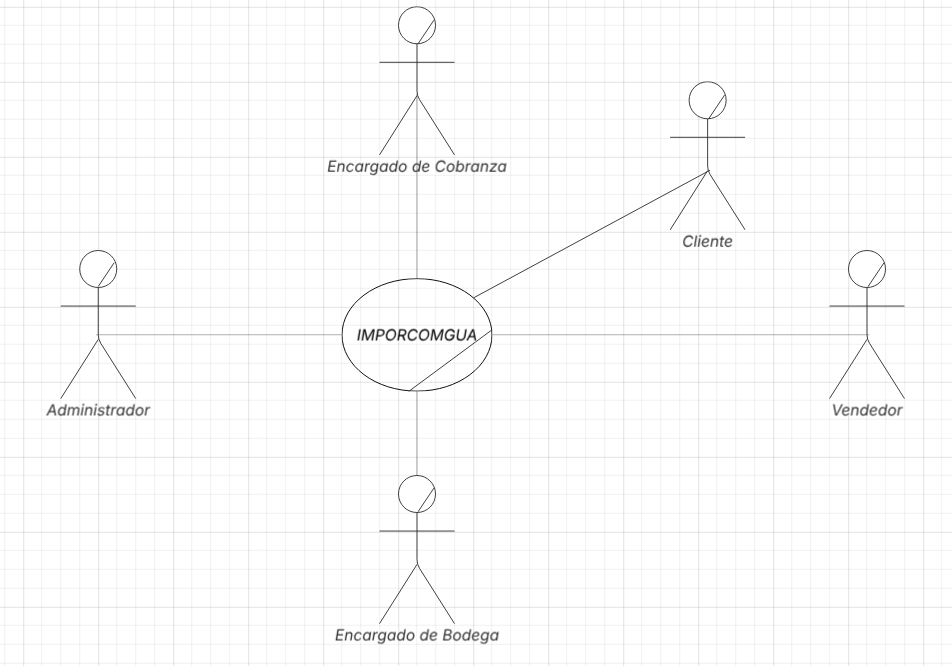

## AyD2 Proyecto único
## Documentación Grupo 1
# IMPORCOMGUA

## 1. Core de Negocio
### A. Descripción

IMPORCOMGUA busca digitalizar de extremo a extremo sus procesos, inventario, comisiones y cobranzas debido a que cuentan con mucha intervención manual, para asegurar que el producto correcto salga a tiempo, la factura se emita sin errores y el dinero ingrese puntualmente. La plataforma web propuesta centraliza la captura de datos, valida las reglas de negocio y expone reportes en tiempo real, de modo que Administrador, Vendedor, Bodeguero y Encargado de Cobranza trabajen sobre la misma fuente de datos. El flujo unificado abarca el mantenimiento de clientes, productos y vendedores. Las entradas / salidas de inventario, el registro de ventas con descuentos, el seguimiento de pagos y el cálculo automático de comisiones, complementado con alertas inteligentes (crédito vencido, stock crítico) que agilizan la toma de decisiones.

| Actor                     | Funciones                                                                                   |
|-------------------------|---------------------------------------------------------------------------------------------|
| **Cliente**             | Solicitar productos, autorizar tipo de pago, efectuar pagos.                                |
| **Vendedor**            | Registrar ventas, aplicar descuentos autorizados, consultar su comisión.                    |
| **Bodeguero**           | Confirmar ingresos DUCA, programar y despachar salidas de bodega.                           |
| **Administrador del sistema** | Gestionar maestros y usuarios, configurar reglas de negocio, emitir reportes.         |
| **Cobranza**            | Registrar abonos, monitorear saldos, disparar alertas de vencimiento.                       |

### B.1 Diagrama de CDU de Alto nivel

### B.2 Diagrama de CDU de Alto nivel Primera descomposición

