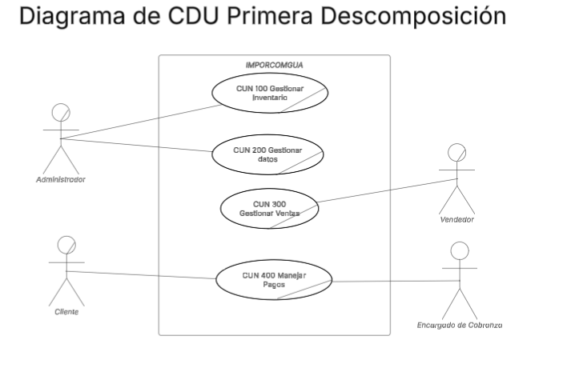
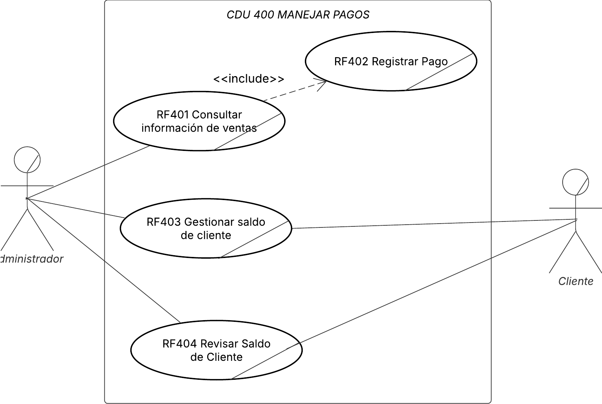

## AyD2 Proyecto único
## Documentación Grupo 1
# IMPORCOMGUA

## 1. Core de Negocio
### A. Descripción

IMPORCOMGUA busca digitalizar de extremo a extremo sus procesos, inventario, comisiones y cobranzas debido a que cuentan con mucha intervención manual, para asegurar que el producto correcto salga a tiempo, la factura se emita sin errores y el dinero ingrese puntualmente. La plataforma web propuesta centraliza la captura de datos, valida las reglas de negocio y expone reportes en tiempo real, de modo que Administrador, Vendedor, Bodeguero y Encargado de Cobranza trabajen sobre la misma fuente de datos. El flujo unificado abarca el mantenimiento de clientes, productos y vendedores. Las entradas / salidas de inventario, el registro de ventas con descuentos, el seguimiento de pagos y el cálculo automático de comisiones, complementado con alertas inteligentes (crédito vencido, stock crítico) que agilizan la toma de decisiones.

| Actor                     | Funciones                                                                                   |
|-------------------------|---------------------------------------------------------------------------------------------|
| **Cliente**             | Solicitar productos, autorizar tipo de pago, efectuar pagos.                                |
| **Vendedor**            | Registrar ventas, aplicar descuentos autorizados, consultar su comisión.                    |
| **Bodeguero**           | Confirmar ingresos DUCA, programar y despachar salidas de bodega.                           |
| **Administrador del sistema** | Gestionar maestros y usuarios, configurar reglas de negocio, emitir reportes.         |
| **Cobranza**            | Registrar abonos, monitorear saldos, disparar alertas de vencimiento.                       |

### B.1 Diagrama de CDU de Alto nivel

### B.2 Diagrama de CDU Primera descomposición

## 2. Drivers Arquitectónicos

## A. Requerimientos funcionales críticos

### Gestión de Inventario (CUN 100)
 El Administrador procesa cada ingreso de mercancía (DUCA), registrando contenedor, documento aduanero y cantidad en fardos/paquetes; el sistema convierte la cantidad a unidades, actualiza el saldo por producto y conserva un rastro histórico. El mismo módulo permite registrar salidas de bodega asociadas a la venta seleccionada y, cuando es necesario, consultar el historial de ventas relacionadas, registrar devoluciones o ajustes de stock y disparar una alerta automática cuando el inventario cae por debajo del umbral mínimo configurado.
### Gestión de Datos (CUN 200)
 El Administrador mantiene las entidades principales. Al crear Clientes se genera el código automáticamente combinando el prefijo de departamento y un correlativo; al crear Productos se fija una sola vez el número de “unidades por fardo/paquete”, valor que luego se reutiliza en inventario y ventas; al crear Vendedores se guarda un porcentaje de comisión que el sistema usará al liquidar las ventas. Cada entidad admite consultar, editar y eliminar.
### Gestión de Ventas (CUN 300)
 El vendedor registra la venta seleccionando cliente, productos y tipo de pago. La aplicación recupera el NIT del cliente, valida la disponibilidad en inventario, calcula totales en unidades y en quetzales y deja la venta en estado “Cobro pendiente”. Puede aplicar descuentos autorizados, anular la venta y, en fase de seguimiento, consultarla mediante filtros. Cuando la venta se liquida, el sistema calcula automáticamente la comisión del vendedor y genera alertas de “crédito vencido” si el plazo pactado expira sin pago.
### Manejo de Pagos (CUN 400)
 El Cliente rellena el formulario de pago y el Encargado de Cobranza registra abonos parciales o totales. Tras buscar la venta y mostrar su detalle, ingresa banco, número de recibo y monto; antes de confirmar el abono revisa la información de cobranza vigente y, en cualquier momento, puede consultar el saldo acumulado del cliente. El sistema actualiza el saldo residual, cambia el estado a “Parcial” o “Pagado” y, en este último caso, registra la fecha de cancelación definitiva. Cuando el saldo llega a cero, el sistema liquida la comisión correspondiente al vendedor.

## 3. Diagramas CDU Expandidos

### 3.1. Gestionar Inventario

### 3.2. Gestionar datos

### 3.3. Gestionar Ventas

### 3.4. CDU 100 Manejar Pagos

## 4. Matrices de Trazabilidad

### A. Stakeholders vs Requerimientos
|Stakeholder|CUN 100|CUN 200|CUN 300|CUN 400|
|-|-|-|-|-|
|Administrador|✅|✅|✅|✅|

### B. Stakeholders vs Casos de Uso
|Stakeholder|CDU 100|CDU 002|CDU 003 |CDU 005|
|-|-|-|-|-|
|Administrador|✅|✅|✅|✅|

### C. Requerimientos vs Casos de uso
|Requerimiento|CDU 100|CDU 002|CDU 003 |CDU 005|
|-|-|-|-|-|
|Gestión de Inventario|✅||||
|Gestión de Datos||✅|||
|Gestión de Ventas|||✅|✅|
|Manejo de Pagos|||✅|✅|