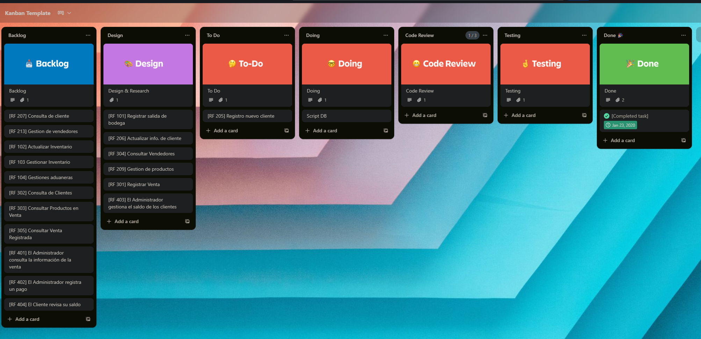

[Grabación - Daily 18 de Junio](https://drive.google.com/file/d/1Y5vc-NZ8K2lKj9EHYq7FBYWa5yKNQhGn/view?usp=sharing)

## Transcripción
Daily 18 de junio

### Participantes y actividades

- **Brandon:** Ayer corrigió los casos de uso 300 y 400. Hoy planificó la gestión de vendedores.
- **Daniel:** Ayer investigó estilos arquitectónicos para realizar las correcciones necesarias de la fase 1. Hoy corrigió el diagrama de despliegue y empezó el RF 301. Ningún impedimento.
- **Joab:** Ayer modificó los mockups para adaptarse a los cambios de los CDU. Hoy va a empezar el registro de salida de bodega en el frontend e iniciando toda la configuración de React y demás herramientas. Ningún impedimento.
- **Jose:** Ayer agregó documentación y los frameworks a utilizar. Hoy modificó el script de la base de datos. Ningún impedimento.
- **Luis René:** Ayer realizó, en base al feedback, las correcciones del CDU 100 y 200. Hoy va a preparar el entorno para las tecnologías a utilizar, al igual que la gestión de productos.
- **William:** Ayer arregló algunos requerimientos funcionales. Hoy diseñará la gestión de los saldos de los clientes. Ningún impedimento.
- **Sebastian:** Ayer corrigió el CDU de alto nivel y la primera descomposición, así como la identificación de los stakeholders. Hoy agregó el script de la base de datos. Ningún impedimento.

