## AyD2 Proyecto único
## Documentación Grupo 1
# IMPORCOMGUA


# Documentación Fase 1

## 1. Core de Negocio
### A. Descripción

IMPORCOMGUA busca digitalizar de extremo a extremo sus procesos, inventario, comisiones y cobranzas debido a que cuentan con mucha intervención manual, para asegurar que el producto correcto salga a tiempo, la factura se emita sin errores y el dinero ingrese puntualmente. La plataforma web propuesta centraliza la captura de datos, valida las reglas de negocio y expone reportes en tiempo real, de modo que Administrador, Vendedor, Bodeguero y Encargado de Cobranza trabajen sobre la misma fuente de datos. El flujo unificado abarca el mantenimiento de clientes, productos y vendedores. Las entradas / salidas de inventario, el registro de ventas con descuentos, el seguimiento de pagos y el cálculo automático de comisiones, complementado con alertas inteligentes (crédito vencido, stock crítico) que agilizan la toma de decisiones.


| Actor                     | Funciones                                                                                   |
|-------------------------|---------------------------------------------------------------------------------------------|
| **Cliente**             | Solicitar productos, autorizar tipo de pago, efectuar pagos.                                |
| **Vendedor**            | Registrar ventas, aplicar descuentos autorizados, consultar su comisión.                    |
| **Bodeguero**           | Confirmar ingresos DUCA, programar y despachar salidas de bodega.                           |
| **Administrador del sistema** | Gestionar maestros y usuarios, configurar reglas de negocio, emitir reportes.         |
| **Cobranza**            | Registrar abonos, monitorear saldos, disparar alertas de vencimiento.                       |

### B.1 Diagrama de CDU de Alto nivel


### B.2 Diagrama de CDU Primera descomposición


# Documentación Fase 2

## 1. Core de Negocio
### A. Descripción

IMPORCOMGUA busca digitalizar de extremo a extremo sus procesos, inventario, comisiones y cobranzas debido a que cuentan con mucha intervención manual, para asegurar que el producto correcto salga a tiempo, la factura se emita sin errores y el dinero ingrese puntualmente. La plataforma web propuesta centraliza la captura de datos, valida las reglas de negocio y expone reportes en tiempo real, de modo que Administrador, Vendedor, Bodeguero y Encargado de Cobranza trabajen sobre la misma fuente de datos. El flujo unificado abarca el mantenimiento de clientes, productos y vendedores. Las entradas / salidas de inventario, el registro de ventas con descuentos, el seguimiento de pagos y el cálculo automático de comisiones, complementado con alertas inteligentes (crédito vencido, stock crítico) que agilizan la toma de decisiones.


### B.1 Diagrama de CDU de Alto nivel


### B.2 Diagrama de CDU Primera descomposición


### B. 4 Identificación de Stakeholders

| Actor                       | Funciones                                                                                        |
|-----------------------------|---------------------------------------------------------------------------------------------------|
| **Cliente**                 | Autorizar y efectuar pagos de sus compras.                                                       |
| **Vendedor**                | Registrar ventas y consultar su comisión.                                                        |
| **Aduana**                  | Verificar DUCA y liberar inventario de importación.                                              |
| **Administrador del sistema** | Gestionar inventario, datos maestros, ventas y pagos; configurar reglas de negocio; emitir reportes. |


## Documentación Fase 3


## 1. Core de Negocio
### A. Descripción

IMPORCOMGUA busca digitalizar de extremo a extremo sus procesos, inventario, comisiones y cobranzas debido a que cuentan con mucha intervención manual, para asegurar que el producto correcto salga a tiempo, la factura se emita sin errores y el dinero ingrese puntualmente. La plataforma web propuesta centraliza la captura de datos, valida las reglas de negocio y expone reportes en tiempo real, de modo que Administrador, Vendedor, Bodeguero y Encargado de Cobranza trabajen sobre la misma fuente de datos. El flujo unificado abarca el mantenimiento de clientes, productos y vendedores. Las entradas / salidas de inventario, el registro de ventas con descuentos, el seguimiento de pagos y el cálculo automático de comisiones, complementado con alertas inteligentes (crédito vencido, stock crítico) que agilizan la toma de decisiones.


### B.1 Diagrama de CDU de Alto nivel


### B.2 Diagrama de CDU Primera descomposición

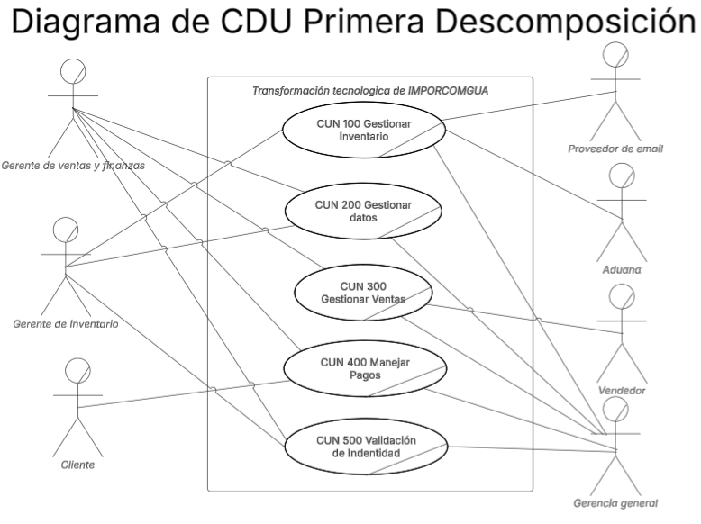

### B. 4 Identificación de Stakeholders

| Actor                                     | Funciones / Responsabilidades                                                                                                                                                  |
| ----------------------------------------- | ------------------------------------------------------------------------------------------------------------------------------------------------------------------------------ |
| **Cliente**                               | Autorizar y efectuar pagos de sus compras, recibir confirmaciones y facturas.                                                                                                  |
| **Vendedor**                              | Registrar ventas, clientes y detalles de pago, consultar sus comisiones y metas.                                                                                               |
| **Aduana**                                | Verificar la DUCA                                                                                           |
| **Administrador del sistema**             | Gestionar inventario, datos maestros, ventas y pagos; configurar reglas de negocio; emitir reportes estratégicos.                                                              |
| **Gerencia General**                      | Acceso completo a todas las funciones: puede crear / editar / eliminar usuarios y asignar roles: recibe alertas de inventario bajo por correo. |
| **Gerente de Ventas y Finanzas**          | Registrar ventas, clientes y pagos.                            |
| **Gerente de Inventario**                 | Registrar productos, ingresos y salidas, recibe alertas automáticas cuando el stock baja de nivel.                          |
| **Encargado de Bodega**                   | Recepcionar mercancía física, actualizar existencias reales y validar movimientos internos de almacén.                                                                         |
| **Proveedores**                           | Suministrar productos .                                                                                            |
| **Proveedor de email** (servicio externo) | Entregar las notificaciones automáticas de inventario a Gerencia General y Gerente de Inventario.        |


# Documentación Fase 1

## 2. Drivers Arquitectónicos

## A. Requerimientos funcionales críticos

### 1. Gestión de Inventario (CUN 100)

- **RF-101 Recepción de mercancía (DUCA)**
  - El sistema debe solicitar:
    - Número de DUCA (si ya existe, número y fecha de DUCA rectificada).
    - Número de contenedor.
    - Fecha de ingreso (autorrellenada, editable).
    - Producto y cantidad en fardos/paquetes.
  - Recuperar automáticamente las unidades por fardo desde la ficha de producto y calcular las unidades totales.
  - Actualizar el saldo del producto y guardar el movimiento en el historial.

- **RF-102 Despacho de productos**
  - Seleccionar una venta vigente y marcar sus productos como despachados.
  - Restar las unidades correspondientes del inventario.

- **RF-103 Revisión de historial de ventas**
  - Mostrar las ventas asociadas al cliente o al producto para ayudar a elegir el despacho.

- **RF-104 Salida de bodega**
  - Registrar la fecha de salida y el responsable; actualizar el saldo de inventario al confirmar la salida.

- **RF-105 Recibir productos**
  - Permite añadir productos debido a la recepción de los mismos.

- **RF-106 Cálculo de unidades**
  - Multiplicar la cantidad en fardos/paquetes por unidades por fardo y mostrar el resultado.

- **RF-107 Actualización de inventario**
  - Reflejar el saldo final de cada producto después de cualquier movimiento.

- **RF-108 Supervisión de niveles**
  - Mostrar el stock actual.

- **RF-109 Alerta de bajo nivel**
  - Enviar notificación al Administrador cuando el inventario de un producto sea menor al mínimo.

---

### 2. Gestionar datos (CUN 200)

#### 2.1 Clientes

- **RF-201 Registrar Cliente**
  - Solicitar: nombre del negocio, nombre del contacto, NIT, departamento, municipio, tipo de venta.
  - Generar automáticamente el código de cliente (prefijo de departamento + correlativo).

- **RF-202 Consultar Cliente**
  - Buscar por código de cliente o NIT para mostrar los datos del usuario.

- **RF-203 Actualizar Cliente**
  - Permitir modificar datos no clave (teléfono, dirección, observaciones).

- **RF-204 Dar de baja Cliente**
  - Marcar al cliente como inactivo y conservar su historial de ventas.

#### 2.2 Productos

- **RF-205 Registrar Producto**
  - Solicitar: código, nombre, unidad de medida, unidades por fardo/paquete.

- **RF-206 Consultar Producto**
  - Buscar por código o nombre y mostrar disponibilidad actual.

- **RF-207 Actualizar Producto**
  - Permitir editar precio, nombre o unidades.

- **RF-208 Retirar Producto de catálogo**
  - Marcar el producto como no disponible para nuevas ventas.

#### 2.3 Vendedores

- **RF-209 Registrar Vendedor**
  - Solicitar datos personales y porcentaje de comisión.

- **RF-210 Consultar Vendedor**
  - Mostrar los datos del vendedor con historial de ventas.

- **RF-211 Actualizar Vendedor**
  - Permitir modificar teléfono o porcentaje de comisión.

- **RF-212 Dar de baja Vendedor**
  - Marcar al vendedor como inactivo sin eliminar registros anteriores.

---

### 3. Gestionar Ventas (CUN 300)

- **RF-301 Registrar Venta**
  - El sistema debe solicitar:
    - Fecha de venta (autorrellenada, editable).
    - Cliente (Se recupera automáticamente su NIT).
    - Productos (código o nombre + cantidad).
    - Tipo de pago (contado/crédito) y, si es crédito, días de plazo.
    - Vendedor.
    - Número de envío (obligatorio).
    - Datos de factura (número DTE, nombre y NIT de factura) opcionales.
  - Validar disponibilidad en inventario.
  - Calcular cantidades en unidades, precio por fardo/paquete y total en quetzales.
  - Guardar la venta con estado inicial “Cobro pendiente” y estado “Vigente”.

- **RF-302 Aplicar Descuento**
  - Permitir aplicar un porcentaje de descuento autorizado y recalcular totales.

- **RF-303 Anular Venta**
  - Cambiar el estado a “Anulada” y devolver stock al inventario.

- **RF-304 Consultar Venta**
  - Buscar por número de envío, cliente o fecha y mostrar detalle.

- **RF-305 Alerta de crédito vencido**
  - Generar notificación si la venta a crédito supera el plazo pactado sin pago.

- **RF-306 Liquidar Comisión**
  - Una vez pagada la venta, calcular y registrar la comisión del vendedor.

---

### 4. Manejar Datos (CUN 400)

- **RF-401 Registrar Pago**
  - Seleccionar la venta y solicitar:
    - Fecha de pago.
    - Banco (Industrial, Banrural, G&T, BAM).
    - Número de cuenta y n.º de transferencia/depósito.
    - Número de recibo de caja.
    - Monto de abono.
  - Antes de confirmar, mostrar saldo pendiente.

- **RF-402 Revisar Información de Cobranza**
  - Mostrar al encargado el saldo pendiente, los días de crédito restantes y la lista de abonos anteriores.

- **RF-403 Registrar Medio de Pago**
  - Identificar si la cuenta está en estado “Pagado en su totalidad” o “Pago Parcial” si no se cubrió la totalidad del monto.

- **RF-404 Actualizar Estado de Cobro**
  - Recalcular saldo y cambiar estado a “Parcial” o “Pagado”; registrar la fecha de cancelación definitiva si el saldo llega a cero.

- **RF-405 Consultar Saldo de Cliente**
  - Permitir al encargado ver en cualquier momento el saldo de un cliente.

- **RF-406 Liquidar Comisión en Pago Total**
  - Cuando el saldo llegue a cero, se liquidará automáticamente la comisión correspondiente al vendedor.

## B. Requerimientos no funcionales

### 2.1 Rendimiento y capacidad
- Las operaciones de alta — ventas, abonos y recepciones de inventario— deben finalizar en **≤ 5 s** con hasta **200 transacciones concurrentes**.  
- Para lograrlo se emplearán índices en las tablas principales y consultas paginadas; si el volumen crece, bastará optimizar los índices o mover la base a un servidor con más recursos, sin tocar el código.

### 2.2 Escalabilidad
- El sistema se construirá con **capas separadas (presentación, lógica y datos)** y variables de entorno para las conexiones; así, en el futuro podrá trasladarse a un servidor con mayor CPU/RAM o duplicarse en otra instancia **sin reescribir la aplicación**.  

### 2.3 Disponibilidad
- Se exige una disponibilidad práctica de **≥ 95 %** en horario laboral.  
- Una única instancia con reinicios automáticos ante fallo.

### 2.4 Seguridad y cumplimiento
- Contraseñas almacenadas con **SHA-256**.  
- Acceso cifrado vía **HTTPS (TLS 1.2 o superior)**.  
- Control de acceso por roles (Administrador, Vendedor, Bodeguero, Cobranza, Cliente).  
- Se registrará en bitácora la creación, edición o eliminación de ventas, pagos e inventario para auditoría.

### 2.5 Usabilidad
- Interfaz web **responsiva** con validación en línea para minimizar errores de captura.  
- Usuarios operativos (bodega y cobranza) deberán dominar sus tareas habituales tras **dos sesiones de práctica** como máximo.

### 2.6 Mantenibilidad
- Repositorio Git con código comentado y un **README** de instalación.  
- Al menos **una prueba automática** por módulo crítico (Inventario, Ventas, Pagos).  

### 2.7 Portabilidad / despliegue
- La aplicación debe poder ejecutarse localmente (ambiente de desarrollo) y, en su entrega final, **deploy** a una instancia **AWS EC2**.
- La misma versión de código debe correr sin cambios entre ambos entornos.


# Documentación Fase 2
## 2. Drivers Arquitectónicos

## A. Requerimientos funcionales críticos

### 1. Gestión de Inventario (CUN 100)

- **RF-101 Recepción de mercancía (DUCA)**
  - El sistema debe solicitar:
    - Número de DUCA (si ya existe, número y fecha de DUCA rectificada).
    - Número de contenedor.
    - Fecha de ingreso (autorrellenada, editable).
    - Producto y cantidad en fardos/paquetes.
  - Recuperar automáticamente las unidades por fardo desde la ficha de producto y calcular las unidades totales.
  - Actualizar el saldo del producto y guardar el movimiento en el historial.

- **RF-102 Despacho de productos**
  - Seleccionar una venta vigente y marcar sus productos como despachados.
  - Restar las unidades correspondientes del inventario.

- **RF-103 Revisión de historial de ventas**
  - Mostrar las ventas asociadas al cliente o al producto para ayudar a elegir el despacho.

- **RF-104 Salida de bodega**
  - Registrar la fecha de salida y el responsable; actualizar el saldo de inventario al confirmar la salida.

- **RF-105 Recibir productos**
  - Permite añadir productos debido a la recepción de los mismos.

- **RF-106 Cálculo de unidades**
  - Multiplicar la cantidad en fardos/paquetes por unidades por fardo y mostrar el resultado.

- **RF-107 Actualización de inventario**
  - Reflejar el saldo final de cada producto después de cualquier movimiento.

- **RF-108 Supervisión de niveles**
  - Mostrar el stock actual.

---

### 2. Gestionar datos (CUN 200)

#### 2.1 Clientes

- **RF-201 Registrar Cliente**
  - Solicitar: nombre del negocio, nombre del contacto, NIT, departamento, municipio, tipo de venta.
  - Generar automáticamente el código de cliente (prefijo de departamento + correlativo).

- **RF-202 Consultar Cliente**
  - Buscar por código de cliente o NIT para mostrar los datos del usuario.

- **RF-203 Actualizar Cliente**
  - Permitir modificar datos no clave (teléfono, dirección, observaciones).

- **RF-204 Dar de baja Cliente**
  - Marcar al cliente como inactivo y conservar su historial de ventas.

#### 2.2 Productos

- **RF-205 Registrar Producto**
  - Solicitar: código, nombre, unidad de medida, unidades por fardo/paquete.

- **RF-206 Consultar Producto**
  - Buscar por código o nombre y mostrar disponibilidad actual.

- **RF-207 Actualizar Producto**
  - Permitir editar precio, nombre o unidades.

- **RF-208 Retirar Producto de catálogo**
  - Marcar el producto como no disponible para nuevas ventas.

#### 2.3 Vendedores

- **RF-209 Registrar Vendedor**
  - Solicitar datos personales y porcentaje de comisión.

- **RF-210 Consultar Vendedor**
  - Mostrar los datos del vendedor con historial de ventas.

- **RF-211 Actualizar Vendedor**
  - Permitir modificar teléfono o porcentaje de comisión.

- **RF-212 Dar de baja Vendedor**
  - Marcar al vendedor como inactivo sin eliminar registros anteriores.

---

### 3. Gestionar Ventas (CUN 300)

- **RF-301 Registrar Venta**
  - El sistema debe solicitar:
    - Fecha de venta (autorrellenada, editable).
    - Cliente (Se recupera automáticamente su NIT).
    - Productos (código o nombre + cantidad).
    - Tipo de pago (contado/crédito) y, si es crédito, días de plazo.
    - Vendedor.
    - Número de envío (obligatorio).
    - Datos de factura (número DTE, nombre y NIT de factura) opcionales.
  - Validar disponibilidad en inventario.
  - Calcular cantidades en unidades, precio por fardo/paquete y total en quetzales.
  - Guardar la venta con estado inicial “Cobro pendiente” y estado “Vigente”.

- **RF-302 Aplicar Descuento**
  - Permitir aplicar un porcentaje de descuento autorizado y recalcular totales.

- **RF-304 Consultar Venta**
  - Buscar por número de envío, cliente o fecha y mostrar detalle.

- **RF-305 Liquidar Comisión**
  - Una vez pagada la venta, calcular y registrar la comisión del vendedor.

---

### 4. Manejar Datos (CUN 400)

- **RF-401 Registrar Pago**
  - Seleccionar la venta y solicitar:
    - Fecha de pago.
    - Banco (Industrial, Banrural, G&T, BAM).
    - Número de cuenta y n.º de transferencia/depósito.
    - Número de recibo de caja.
    - Monto de abono.
  - Antes de confirmar, mostrar saldo pendiente.

- **RF-402 Revisar Información de Cobranza**
  - Mostrar al encargado el saldo pendiente, los días de crédito restantes y la lista de abonos anteriores.

- **RF-403 Registrar Medio de Pago**
  - Identificar si la cuenta está en estado “Pagado en su totalidad” o “Pago Parcial” si no se cubrió la totalidad del monto.

- **RF-404 Actualizar Estado de Cobro**
  - Recalcular saldo y cambiar estado a “Parcial” o “Pagado”; registrar la fecha de cancelación definitiva si el saldo llega a cero.

- **RF-405 Consultar Saldo de Cliente**
  - Permitir al encargado ver en cualquier momento el saldo de un cliente.

- **RF-406 Liquidar Comisión en Pago Total**
  - Cuando el saldo llegue a cero, se liquidará automáticamente la comisión correspondiente al vendedor.

## B. Requerimientos no funcionales

### 2.1 Rendimiento y capacidad
- Las operaciones de alta — ventas, abonos y recepciones de inventario— deben finalizar en **≤ 5 s** con hasta **200 transacciones concurrentes**.  
- Para lograrlo se emplearán índices en las tablas principales y consultas paginadas; si el volumen crece, bastará optimizar los índices o mover la base a un servidor con más recursos, sin tocar el código.

### 2.2 Escalabilidad
- El sistema se construirá con **capas separadas (presentación, lógica y datos)** y variables de entorno para las conexiones; así, en el futuro podrá trasladarse a un servidor con mayor CPU/RAM o duplicarse en otra instancia **sin reescribir la aplicación**.  

### 2.3 Disponibilidad
- Se exige una disponibilidad práctica de **≥ 95 %** en horario laboral.  
- Una única instancia con reinicios automáticos ante fallo.

### 2.4 Seguridad y cumplimiento
- Contraseñas almacenadas con **SHA-256**.  
- Acceso cifrado vía **HTTPS (TLS 1.2 o superior)**.  
- Control de acceso por roles (Administrador, Vendedor, Bodeguero, Cobranza, Cliente).  
- Se registrará en bitácora la creación, edición o eliminación de ventas, pagos e inventario para auditoría.

### 2.5 Usabilidad
- Interfaz web **responsiva** con validación en línea para minimizar errores de captura.  
- Usuarios operativos (bodega y cobranza) deberán dominar sus tareas habituales tras **dos sesiones de práctica** como máximo.

### 2.6 Mantenibilidad
- Repositorio Git con código comentado y un **README** de instalación.  
- Al menos **una prueba automática** por módulo crítico (Inventario, Ventas, Pagos).  

### 2.7 Portabilidad / despliegue
- La aplicación debe poder ejecutarse localmente (ambiente de desarrollo) y, en su entrega final, **deploy** a una instancia **AWS EC2**.
- La misma versión de código debe correr sin cambios entre ambos entornos.


## C. Requerimientos de Restricción

### R-01: Restricción Temporal
**Descripción:** El proyecto debe completarse en el transcurso de un mes, dividido en tres fases específicas con entregables definidos.

**Justificación:** La empresa IMPORCOMGUA requiere una implementación rápida debido a las ineficiencias operativas actuales que están impactando la productividad y capacidad de respuesta hacia clientes.

**Impacto en la arquitectura:**
- Necesidad de implementar una arquitectura modular que permita desarrollo incremental
- Priorización de funcionalidades críticas para el MVP (Fase 2)
- Selección de tecnologías maduras y bien documentadas para reducir curva de aprendizaje
- Reutilización de componentes y patrones de diseño establecidos

### R-02: Restricción de Recursos Humanos
**Descripción:** El desarrollo debe ser realizado por un equipo de tamaño limitado (grupo de 7 personas) con roles específicos y participación validada de todos los integrantes.

**Justificación:** Todos los integrantes deben estar presentes en la calificación y tener commits sustanciales a lo largo del desarrollo.

**Impacto en la arquitectura:**
- Diseño de arquitectura simple y comprensible para facilitar el trabajo colaborativo
- Implementación de patrones de diseño conocidos para reducir complejidad
- Documentación exhaustiva para facilitar la colaboración del equipo
- División clara de responsabilidades entre módulos del sistema

### R-03: Restricción de Plataforma Web
**Descripción:** La solución debe ser una aplicación web que permita automatizar y optimizar los procesos clave del negocio.

**Justificación:** IMPORCOMGUA requiere una solución tecnológica web accesible desde diferentes ubicaciones y dispositivos.

**Impacto en la arquitectura:**
- Implementación de protocolos web estándar (HTTP/HTTPS)
- Consideración de navegadores web como plataforma de ejecución
- Diseño de interfaces adaptables a diferentes dispositivos

### R-04: Restricción de Despliegue en la Nube
**Descripción:** El sistema final debe ser desplegado en un entorno en la nube, preparado para el entorno operativo de IMPORCOMGUA.

**Justificación:** Necesidad de escalabilidad, disponibilidad y mantenimiento eficiente del sistema.

**Impacto en la arquitectura:**
- Arquitectura compatible con servicios de nube
- Implementación de patrones cloud-native
- Configuración para ambientes distribuidos

### R-05: Restricción de Metodología Ágil
**Descripción:** El desarrollo debe seguir una metodología ágil con iteraciones rápidas, validación continua y entrega incremental de funcionalidades.

**Justificación:** Necesidad de gestión eficiente del tiempo, colaboración continua y alineación con prioridades del cliente.

**Impacto en la arquitectura:**
- Arquitectura modular que permita desarrollo e integración incremental
- Diseño de componentes independientes para facilitar iteraciones
- Implementación de interfaces bien definidas entre módulos

---

# Documentación fase 3

### 1. Gestionar Inventario (CUN 100)

- **RF-101 Registrar Salida de Bodega**  
  - Registrar salida de mercancía de la bodega.

- **RF-102 Actualizar Inventario**  
  - Actualizar cantidades y registros del inventario.

- **RF-103 Gestionar Inventario**  
  - Administrar movimientos e ingresos de inventario.

- **RF-104 Gestiones Aduana (DUCA)**  
  - Tramitar y gestionar el DUCA con la Aduana.

- **RF-105 Gestionar Stock Bajo**  
  - Detectar niveles bajos de inventario y notificar.

---

### 2. Gestionar Datos (CUN 200)

- **RF-205 Registrar Nuevo Cliente**  
  - Registrar un nuevo cliente en el sistema.

- **RF-206 Consultar Clientes**  
  - Buscar y mostrar información de clientes.

- **RF-207 Actualizar Datos de Cliente**  
  - Modificar información de un cliente existente.

- **RF-208 Dar de Baja Cliente**  
  - Desactivar o eliminar un cliente.

- **RF-209 Registrar Producto**  
  - Registrar un nuevo producto en el catálogo.

- **RF-210 Consultar Producto**  
  - Buscar y mostrar información de productos.

- **RF-211 Actualizar Datos de Producto**  
  - Modificar información de un producto existente.

- **RF-212 Retirar Producto de Catálogo**  
  - Eliminar o desactivar un producto.

- **RF-213 Registrar Vendedor**  
  - Registrar un nuevo vendedor en el sistema.

- **RF-214 Consultar Vendedor**  
  - Buscar y mostrar información de vendedores.

- **RF-215 Actualizar Datos de Vendedor**  
  - Modificar información de un vendedor existente.

- **RF-216 Dar de Baja Vendedor**  
  - Desactivar o eliminar un vendedor.

- **RF-218 Registrar Usuarios**  
  - Registrar un nuevo usuario del sistema.

- **RF-219 Actualizar Datos de Usuario**  
  - Modificar información de un usuario existente.

- **RF-220 Consultar Usuarios**  
  - Buscar y mostrar información de usuarios.

- **RF-221 Dar de Baja Usuario**  
  - Desactivar o eliminar un usuario.

---

### 3. Gestionar Ventas (CUN 300)

- **RF-301 Registrar Venta**  
  - Registrar una venta con cliente, productos, forma de pago y vendedor.

- **RF-302 Consultar Cliente**  
  - Buscar detalles de un cliente.

- **RF-303 Consultar Productos**  
  - Buscar detalles de un producto.

- **RF-304 Consultar Vendedores**  
  - Buscar detalles de un vendedor.

- **RF-305 Consultar Venta**  
  - Buscar y mostrar el detalle de una venta.

---

### 4. Manejar Pagos (CUN 400)

- **RF-401 Consultar Información de Ventas**  
  - Obtener listado y estado de ventas.

- **RF-402 Registrar Pago**  
  - Registrar el pago de una o varias ventas.

- **RF-403 Gestionar Saldo de Cliente**  
  - Actualizar saldo pendiente de un cliente.

- **RF-404 Revisar Saldo de Cliente**  
  - Mostrar el saldo actual pendiente de cobro.

---

### 5. Validación de Identidad (CUN 500)

- **RF-501 Validación de datos de Usuario**  
  - Solicitar usuario y contraseña; verificar identidad y rol.

- **RF-502 Datos Gerencia General**  
  - Consultar y actualizar datos de la Gerencia General.

- **RF-503 Datos Gerencia de Ventas y Finanzas**  
  - Consultar y actualizar datos del Gerente de Ventas y Finanzas.

- **RF-504 Datos Gerencia de Inventario**  
  - Consultar y actualizar datos del Gerente de Inventario.


## B. Requerimientos no funcionales

### 2.1 Rendimiento y capacidad
- Las operaciones de alta — ventas, abonos y recepciones de inventario— deben finalizar en **≤ 5 s** con hasta **200 transacciones concurrentes**.  
- Para lograrlo se emplearán índices en las tablas principales y consultas paginadas; si el volumen crece, bastará optimizar los índices o mover la base a un servidor con más recursos, sin tocar el código.

### 2.2 Escalabilidad
- El sistema se construirá con **capas separadas (presentación, lógica y datos)** y variables de entorno para las conexiones; así, en el futuro podrá trasladarse a un servidor con mayor CPU/RAM o duplicarse en otra instancia **sin reescribir la aplicación**.  

### 2.3 Disponibilidad
- Se exige una disponibilidad práctica de **≥ 95 %** en horario laboral.  
- Una única instancia con reinicios automáticos ante fallo.

### 2.4 Seguridad y cumplimiento
- Contraseñas almacenadas con **SHA-256**.  
- Acceso cifrado vía **HTTPS (TLS 1.2 o superior)**.  
- Control de acceso por roles (Administrador, Vendedor, Bodeguero, Cobranza, Cliente).  
- Se registrará en bitácora la creación, edición o eliminación de ventas, pagos e inventario para auditoría.

### 2.5 Usabilidad
- Interfaz web **responsiva** con validación en línea para minimizar errores de captura.  
- Usuarios operativos (bodega y cobranza) deberán dominar sus tareas habituales tras **dos sesiones de práctica** como máximo.

### 2.6 Mantenibilidad
- Repositorio Git con código comentado y un **README** de instalación.  
- Al menos **una prueba automática** por módulo crítico (Inventario, Ventas, Pagos).  

### 2.7 Portabilidad / despliegue
- La aplicación debe poder ejecutarse localmente (ambiente de desarrollo) y, en su entrega final, **deploy** a una instancia **AWS EC2**.
- La misma versión de código debe correr sin cambios entre ambos entornos.


## C. Requerimientos de Restricción

### R-01: Restricción Temporal
**Descripción:** El proyecto debe completarse en el transcurso de un mes, dividido en tres fases específicas con entregables definidos.

**Justificación:** La empresa IMPORCOMGUA requiere una implementación rápida debido a las ineficiencias operativas actuales que están impactando la productividad y capacidad de respuesta hacia clientes.

**Impacto en la arquitectura:**
- Necesidad de implementar una arquitectura modular que permita desarrollo incremental
- Priorización de funcionalidades críticas para el MVP (Fase 2)
- Selección de tecnologías maduras y bien documentadas para reducir curva de aprendizaje
- Reutilización de componentes y patrones de diseño establecidos

### R-02: Restricción de Recursos Humanos
**Descripción:** El desarrollo debe ser realizado por un equipo de tamaño limitado (grupo de 7 personas) con roles específicos y participación validada de todos los integrantes.

**Justificación:** Todos los integrantes deben estar presentes en la calificación y tener commits sustanciales a lo largo del desarrollo.

**Impacto en la arquitectura:**
- Diseño de arquitectura simple y comprensible para facilitar el trabajo colaborativo
- Implementación de patrones de diseño conocidos para reducir complejidad
- Documentación exhaustiva para facilitar la colaboración del equipo
- División clara de responsabilidades entre módulos del sistema

### R-03: Restricción de Plataforma Web
**Descripción:** La solución debe ser una aplicación web que permita automatizar y optimizar los procesos clave del negocio.

**Justificación:** IMPORCOMGUA requiere una solución tecnológica web accesible desde diferentes ubicaciones y dispositivos.

**Impacto en la arquitectura:**
- Implementación de protocolos web estándar (HTTP/HTTPS)
- Consideración de navegadores web como plataforma de ejecución
- Diseño de interfaces adaptables a diferentes dispositivos

### R-04: Restricción de Despliegue en la Nube
**Descripción:** El sistema final debe ser desplegado en un entorno en la nube, preparado para el entorno operativo de IMPORCOMGUA.

**Justificación:** Necesidad de escalabilidad, disponibilidad y mantenimiento eficiente del sistema.

**Impacto en la arquitectura:**
- Arquitectura compatible con servicios de nube
- Implementación de patrones cloud-native
- Configuración para ambientes distribuidos

### R-05: Restricción de Metodología Ágil
**Descripción:** El desarrollo debe seguir una metodología ágil con iteraciones rápidas, validación continua y entrega incremental de funcionalidades.

**Justificación:** Necesidad de gestión eficiente del tiempo, colaboración continua y alineación con prioridades del cliente.

**Impacto en la arquitectura:**
- Arquitectura modular que permita desarrollo e integración incremental
- Diseño de componentes independientes para facilitar iteraciones
- Implementación de interfaces bien definidas entre módulos

---


# Documentación Fase 1

## 3. Diagramas CDU Expandidos

### 3.1. Gestionar Inventario


#### 3.1.1. Descripción de casos de uso de CDU 100 Gestionar Inventario
| **Nombre**                     | **RF101 Gestionar recepción de mercancía**         |
|---------------------------------|--------------------------------------------|
| **Actores**                    | Administrador                              |
| **Propósito**                  | Gestionar la recepción de productos en el inventario. |
| **Resumen**                    | El caso de uso inicia cuando el Administrador recibe mercancía en el almacén. El proceso incluye verificar los productos recibidos, registrarlos en el sistema y asegurar que coincidan con el pedido. |
| **Flujo de trabajo**           | - Básico (normal)                          |
|                                 | 1. El Administrador recibe los productos en el almacén. |
|                                 | 2. El Administrador verifica que los productos coincidan con la orden de compra. |
|                                 | 3. El Administrador registra los productos recibidos en el sistema. |
|                                 | 4. El sistema actualiza el inventario con los productos recibidos. |
| **Prioridad**                  | Alta                                       |
| **Mejoras**                    | Implementar una validación automática de productos contra las órdenes de compra para asegurar la precisión en la recepción |

---

| **Nombre**                     | **RF102 Despachar productos**                    |
|---------------------------------|--------------------------------------------|
| **Actores**                    | Administrador                              |
| **Propósito**                  | Despachar productos a los clientes o a otras áreas de la empresa. |
| **Resumen**                    | El caso de uso inicia cuando el Administrador recibe una solicitud para despachar productos. El proceso incluye la verificación de existencia en el inventario y la actualización de registros. |
| **Flujo de trabajo**           | - Básico (normal)                          |
|                                 | 1. El Administrador recibe la solicitud para despachar productos. |
|                                 | 2. El Administrador verifica que los productos estén disponibles en el inventario. |
|                                 | 3. El Administrador despacha los productos solicitados. |
|                                 | 4. El sistema actualiza el inventario y registra la salida de productos. |
| **Prioridad**                  | Alta                                       |
| **Mejoras**                    | Implementar seguimiento de pedidos en tiempo real. |

---

| **Nombre**                     | **RF103 Revisar historial de ventas**            |
|---------------------------------|--------------------------------------------|
| **Actores**                    | Administrador                              |
| **Propósito**                  | Revisar el historial de ventas de productos en el sistema. |
| **Resumen**                    | El caso de uso inicia cuando el Administrador solicita ver el historial de ventas. El proceso permite obtener datos históricos de productos vendidos para análisis o reportes. |
| **Flujo de trabajo**           | - Básico (normal)                          |
|                                 | 1. El Administrador solicita revisar el historial de ventas. |
|                                 | 2. El sistema consulta los registros de ventas anteriores. |
|                                 | 3. El Administrador recibe el reporte de ventas. |
| **Prioridad**                  | Media                                      |
| **Mejoras**                    | Añadir filtros por fecha y producto. |

---

| **Nombre**                     | **RF104 Registrar salida de bodega**             |
|---------------------------------|--------------------------------------------|
| **Actores**                    | Administrador                              |
| **Propósito**                  | Registrar la salida de productos del inventario para su entrega o venta. |
| **Resumen**                    | El caso de uso inicia cuando el Administrador procesa la salida de productos. El sistema actualiza el inventario y registra la transacción. |
| **Flujo de trabajo**           | - Básico (normal)                          |
|                                 | 1. El Administrador recibe la solicitud para registrar la salida de productos. |
|                                 | 2. El Administrador verifica que los productos estén disponibles en el inventario. |
|                                 | 3. El Administrador registra la salida de los productos en el sistema. |
| **Prioridad**                  | Alta                                       |
| **Mejoras**                    | Implementar notificaciones de bajo stock. |

---

| **Nombre**                     | **RF105 Recibir productos**                     |
|---------------------------------|--------------------------------------------|
| **Actores**                    | Administrador                              |
| **Propósito**                  | Recibir y registrar productos que lleguen a la bodega. |
| **Resumen**                    | El caso de uso inicia cuando el Administrador recibe productos. El proceso incluye verificar los productos recibidos y actualizar el inventario. |
| **Flujo de trabajo**           | - Básico (normal)                          |
|                                 | 1. El Administrador recibe los productos. |
|                                 | 2. El Administrador verifica la cantidad y condición de los productos. |
|                                 | 3. El Administrador actualiza el inventario con los productos recibidos. |
| **Prioridad**                  | Alta                                       |
| **Mejoras**                    | Integrar escaneo automático para una mejor precisión. |

---

| **Nombre**                     | **RF106 Calcular unidades totales**             |
|---------------------------------|--------------------------------------------|
| **Actores**                    | Administrador                              |
| **Propósito**                  | Calcular el total de unidades de productos en inventario. |
| **Resumen**                    | El caso de uso inicia cuando el Administrador solicita calcular el total de unidades en inventario. El sistema realiza los cálculos y presenta el resultado. |
| **Flujo de trabajo**           | - Básico (normal)                          |
|                                 | 1. El Administrador solicita calcular el total de unidades. |
|                                 | 2. El sistema realiza el cálculo del total de unidades de productos disponibles. |
|                                 | 3. El Administrador recibe el reporte con el total de unidades. |
| **Prioridad**                  | Media                                      |
| **Mejoras**                    | Agregar cálculos automáticos periódicos. |

---

| **Nombre**                     | **RF107 Actualizar inventario**                  |
|---------------------------------|--------------------------------------------|
| **Actores**                    | Administrador                              |
| **Propósito**                  | Actualizar el inventario después de cada transacción. |
| **Resumen**                    | El caso de uso inicia cuando se realiza una acción que requiere actualizar el inventario, como la recepción o salida de productos. |
| **Flujo de trabajo**           | - Básico (normal)                          |
|                                 | 1. El Administrador realiza una transacción que afecta al inventario. |
|                                 | 2. El sistema actualiza automáticamente el inventario con la transacción realizada. |
| **Prioridad**                  | Alta                                       |
| **Mejoras**                    | Mejorar la sincronización en tiempo real. |

---

| **Nombre**                     | **RF108 Supervisar niveles de inventario**       |
|---------------------------------|--------------------------------------------|
| **Actores**                    | Administrador                              |
| **Propósito**                  | Supervisar los niveles de inventario para asegurar que no haya desabastecimiento. |
| **Resumen**                    | El caso de uso inicia cuando el Administrador revisa los niveles de inventario para garantizar que haya suficientes existencias. |
| **Flujo de trabajo**           | - Básico (normal)                          |
|                                 | 1. El Administrador revisa los niveles de inventario. |
|                                 | 2. El sistema presenta el reporte de los niveles actuales. |
|                                 | 3. El Administrador toma decisiones para reordenar productos si es necesario. |
| **Prioridad**                  | Alta                                       |
| **Mejoras**                    | Incorporar alertas automáticas para productos de bajo stock. |

---

| **Nombre**                     | **RF109 Notificar bajo nivel de inventario**     |
|---------------------------------|--------------------------------------------|
| **Actores**                    | Administrador                              |
| **Propósito**                  | Notificar cuando los niveles de inventario caen por debajo del umbral mínimo. |
| **Resumen**                    | El caso de uso se activa cuando el sistema detecta que los niveles de inventario de un producto son bajos. El Administrador recibe una notificación. |
| **Flujo de trabajo**           | - Básico (normal)                          |
|                                 | 1. El sistema detecta que el inventario de un producto está bajo. |
|                                 | 2. El sistema envía una notificación al Administrador. |
| **Prioridad**                  | Alta                                       |
| **Mejoras**                    | Implementar un sistema de notificación más avanzado con diferentes canales. |

### 3.2. Gestionar datos
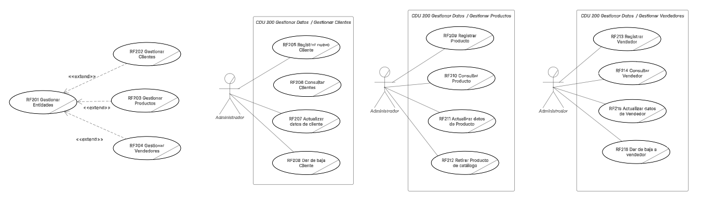

#### 3.2.1. Descripción de casos de uso de CDU 200 Gestionar Datos
| **Nombre**                     | **RF201 Gestionar Entidades**              |
|---------------------------------|--------------------------------------------|
| **Actores**                    | Administrador                              |
| **Propósito**                  | Gestionar las entidades dentro del sistema, como clientes, productos y vendedores. |
| **Resumen**                    | El caso de uso inicia cuando el Administrador decide gestionar las entidades dentro del sistema, realizando las actualizaciones necesarias. |
| **Flujo de trabajo**           | - Básico (normal)                          |
|                                 | 1. El Administrador accede al módulo de gestión de entidades. |
|                                 | 2. El Administrador selecciona la entidad que desea gestionar (cliente, producto, vendedor). |
|                                 | 3. El Administrador actualiza o elimina la entidad seleccionada. |
| **Prioridad**                  | Alta                                       |
| **Mejoras**                    | Mejorar la interfaz de usuario para facilitar la gestión de múltiples entidades a la vez. |

---

| **Nombre**                     | **RF202 Gestionar Clientes**               |
|---------------------------------|--------------------------------------------|
| **Actores**                    | Administrador                              |
| **Propósito**                  | Gestionar la información de los clientes en el sistema. |
| **Resumen**                    | El caso de uso inicia cuando el Administrador decide gestionar los datos de un cliente en el sistema, ya sea para agregar, editar o eliminar información. |
| **Flujo de trabajo**           | - Básico (normal)                          |
|                                 | 1. El Administrador accede al módulo de gestión de clientes. |
|                                 | 2. El Administrador selecciona el cliente que desea gestionar. |
|                                 | 3. El Administrador modifica o elimina los datos del cliente. |
| **Prioridad**                  | Alta                                       |
| **Mejoras**                    | Integrar integración con plataformas de CRM para la gestión de clientes. |

---

| **Nombre**                     | **RF203 Gestionar Productos**              |
|---------------------------------|--------------------------------------------|
| **Actores**                    | Administrador                              |
| **Propósito**                  | Gestionar la información de los productos en el sistema. |
| **Resumen**                    | El caso de uso inicia cuando el Administrador decide gestionar los productos, realizando modificaciones, eliminaciones o adiciones de productos al sistema. |
| **Flujo de trabajo**           | - Básico (normal)                          |
|                                 | 1. El Administrador accede al módulo de gestión de productos. |
|                                 | 2. El Administrador selecciona el producto a gestionar. |
|                                 | 3. El Administrador actualiza o elimina el producto. |
| **Prioridad**                  | Alta                                       |
| **Mejoras**                    | Incorporar recomendaciones automáticas sobre productos similares para mejorar la gestión. |

---

| **Nombre**                     | **RF204 Gestionar Vendedores**             |
|---------------------------------|--------------------------------------------|
| **Actores**                    | Administrador                              |
| **Propósito**                  | Gestionar la información de los vendedores dentro del sistema. |
| **Resumen**                    | El caso de uso inicia cuando el Administrador desea gestionar la información de los vendedores, lo que incluye agregar, editar o eliminar los datos del vendedor. |
| **Flujo de trabajo**           | - Básico (normal)                          |
|                                 | 1. El Administrador accede al módulo de gestión de vendedores. |
|                                 | 2. El Administrador selecciona al vendedor que desea gestionar. |
|                                 | 3. El Administrador realiza la modificación o eliminación de los datos del vendedor. |
| **Prioridad**                  | Media                                      |
| **Mejoras**                    | Mejorar la visibilidad de los datos de rendimiento de cada vendedor. |

---

| **Nombre**                     | **RF205 Registrar nuevo Cliente**         |
|---------------------------------|--------------------------------------------|
| **Actores**                    | Administrador                              |
| **Propósito**                  | Registrar un nuevo cliente en el sistema. |
| **Resumen**                    | El caso de uso inicia cuando el Administrador ingresa la información de un cliente nuevo, incluyendo datos básicos como nombre, dirección y contacto. |
| **Flujo de trabajo**           | - Básico (normal)                          |
|                                 | 1. El Administrador accede al módulo de registro de clientes. |
|                                 | 2. El Administrador ingresa la información del nuevo cliente. |
|                                 | 3. El sistema valida y registra la información en el sistema. |
| **Prioridad**                  | Alta                                       |
| **Mejoras**                    | Implementar validación automática de datos para evitar errores. |

---

| **Nombre**                     | **RF206 Dar de baja Cliente**             |
|---------------------------------|--------------------------------------------|
| **Actores**                    | Administrador                              |
| **Propósito**                  | Dar de baja a un cliente en el sistema.   |
| **Resumen**                    | El caso de uso inicia cuando el Administrador decide eliminar un cliente del sistema. |
| **Flujo de trabajo**           | - Básico (normal)                          |
|                                 | 1. El Administrador accede al módulo de gestión de clientes. |
|                                 | 2. El Administrador selecciona el cliente que desea eliminar. |
|                                 | 3. El Administrador confirma la baja y el sistema elimina los datos del cliente. |
| **Prioridad**                  | Media                                      |
| **Mejoras**                    | Implementar un proceso de confirmación adicional para evitar bajas accidentales. |

---

| **Nombre**                     | **RF207 Actualizar datos del Cliente**   |
|---------------------------------|--------------------------------------------|
| **Actores**                    | Administrador                              |
| **Propósito**                  | Actualizar la información de un cliente.  |
| **Resumen**                    | El caso de uso inicia cuando el Administrador desea modificar la información existente de un cliente. |
| **Flujo de trabajo**           | - Básico (normal)                          |
|                                 | 1. El Administrador selecciona el cliente. |
|                                 | 2. El Administrador actualiza los datos del cliente. |
|                                 | 3. El sistema guarda los cambios.          |
| **Prioridad**                  | Alta                                       |
| **Mejoras**                    | Incorporar historial de cambios para seguimiento. |

---

| **Nombre**                     | **RF208 Consultar Clientes**              |
|---------------------------------|--------------------------------------------|
| **Actores**                    | Administrador                              |
| **Propósito**                  | Consultar información de los clientes.    |
| **Resumen**                    | El caso de uso inicia cuando el Administrador desea ver los datos de un cliente registrado. |
| **Flujo de trabajo**           | - Básico (normal)                          |
|                                 | 1. El Administrador accede al módulo de consulta de clientes. |
|                                 | 2. El Administrador selecciona el cliente y consulta la información. |
| **Prioridad**                  | Media                                      |
| **Mejoras**                    | Incorporar filtros avanzados de búsqueda. |

---

| **Nombre**                     | **RF209 Registrar Producto**              |
|---------------------------------|--------------------------------------------|
| **Actores**                    | Administrador                              |
| **Propósito**                  | Registrar un nuevo producto en el sistema. |
| **Resumen**                    | El caso de uso inicia cuando el Administrador ingresa la información de un nuevo producto. |
| **Flujo de trabajo**           | - Básico (normal)                          |
|                                 | 1. El Administrador ingresa los datos del nuevo producto. |
|                                 | 2. El sistema valida y guarda la información del producto. |
| **Prioridad**                  | Alta                                       |
| **Mejoras**                    | Integrar con la base de datos para mostrar productos similares al registrarlos. |

---

| **Nombre**                     | **RF210 Consultar Producto**             |
|---------------------------------|--------------------------------------------|
| **Actores**                    | Administrador                              |
| **Propósito**                  | Consultar la información de un producto registrado. |
| **Resumen**                    | El caso de uso inicia cuando el Administrador desea obtener información detallada de un producto registrado. |
| **Flujo de trabajo**           | - Básico (normal)                          |
|                                 | 1. El Administrador selecciona el producto que desea consultar. |
|                                 | 2. El sistema presenta los detalles del producto. |
| **Prioridad**                  | Media                                      |
| **Mejoras**                    | Mejorar la visualización con imágenes del producto. |

---

| **Nombre**                     | **RF211 Actualizar datos del Producto**  |
|---------------------------------|--------------------------------------------|
| **Actores**                    | Administrador                              |
| **Propósito**                  | Actualizar la información de un producto. |
| **Resumen**                    | El caso de uso inicia cuando el Administrador desea modificar los detalles de un producto registrado. |
| **Flujo de trabajo**           | - Básico (normal)                          |
|                                 | 1. El Administrador selecciona el producto que desea actualizar. |
|                                 | 2. El Administrador modifica los detalles del producto. |
|                                 | 3. El sistema guarda la actualización.    |
| **Prioridad**                  | Alta                                       |
| **Mejoras**                    | Incorporar actualizaciones en tiempo real para evitar inconsistencias. |

---

| **Nombre**                     | **RF212 Retirar Producto de catálogo**   |
|---------------------------------|--------------------------------------------|
| **Actores**                    | Administrador                              |
| **Propósito**                  | Retirar un producto del catálogo del sistema. |
| **Resumen**                    | El caso de uso inicia cuando el Administrador decide retirar un producto del catálogo disponible. |
| **Flujo de trabajo**           | - Básico (normal)                          |
|                                 | 1. El Administrador selecciona el producto a retirar. |
|                                 | 2. El Administrador confirma la eliminación. |
| **Prioridad**                  | Media                                      |
| **Mejoras**                    | Añadir un proceso de archivo en lugar de eliminación completa. |

---

| **Nombre**                     | **RF213 Registrar Vendedor**             |
|---------------------------------|--------------------------------------------|
| **Actores**                    | Administrador                              |
| **Propósito**                  | Registrar un nuevo vendedor en el sistema. |
| **Resumen**                    | El caso de uso inicia cuando el Administrador agrega un nuevo vendedor con sus datos de contacto e información relevante. |
| **Flujo de trabajo**           | - Básico (normal)                          |
|                                 | 1. El Administrador ingresa los datos del nuevo vendedor. |
|                                 | 2. El sistema valida y guarda la información. |
| **Prioridad**                  | Alta                                       |
| **Mejoras**                    | Mejorar la interfaz para ingresar datos rápidamente. |

---

| **Nombre**                     | **RF214 Consultar Vendedor**             |
|---------------------------------|--------------------------------------------|
| **Actores**                    | Administrador                              |
| **Propósito**                  | Consultar los datos de un vendedor registrado. |
| **Resumen**                    | El caso de uso inicia cuando el Administrador desea consultar los detalles de un vendedor. |
| **Flujo de trabajo**           | - Básico (normal)                          |
|                                 | 1. El Administrador selecciona al vendedor a consultar. |
|                                 | 2. El sistema presenta los datos del vendedor. |
| **Prioridad**                  | Media                                      |
| **Mejoras**                    | Mejorar el filtro para búsquedas rápidas. |

---

| **Nombre**                     | **RF215 Actualizar datos de Vendedor**   |
|---------------------------------|--------------------------------------------|
| **Actores**                    | Administrador                              |
| **Propósito**                  | Actualizar la información de un vendedor. |
| **Resumen**                    | El caso de uso inicia cuando el Administrador decide actualizar la información de un vendedor registrado. |
| **Flujo de trabajo**           | - Básico (normal)                          |
|                                 | 1. El Administrador selecciona al vendedor. |
|                                 | 2. El Administrador modifica los datos del vendedor. |
| **Prioridad**                  | Alta                                       |
| **Mejoras**                    | Agregar una opción para ver el historial de modificaciones. |

---

| **Nombre**                     | **RF216 Dar de baja a Vendedor**          |
|---------------------------------|--------------------------------------------|
| **Actores**                    | Administrador                              |
| **Propósito**                  | Dar de baja a un vendedor en el sistema.  |
| **Resumen**                    | El caso de uso inicia cuando el Administrador elimina un vendedor del sistema. |
| **Flujo de trabajo**           | - Básico (normal)                          |
|                                 | 1. El Administrador selecciona al vendedor a dar de baja. |
|                                 | 2. El Administrador confirma la eliminación del vendedor. |
| **Prioridad**                  | Media                                      |
| **Mejoras**                    | Agregar una confirmación de baja final para evitar errores. |


### 3.3. Gestionar Ventas


#### 3.3.1. Descripción de casos de uso de CDU 300 Gestionar Ventas
| **Nombre**                     | **RF301 Registrar Venta**                  |
|---------------------------------|--------------------------------------------|
| **Actores**                    | Administrador                              |
| **Propósito**                  | Registrar una venta en el sistema.        |
| **Resumen**                    | El caso de uso inicia cuando el Administrador registra una venta en el sistema, lo que incluye la selección del cliente, los productos vendidos y la información de pago. |
| **Flujo de trabajo**           | - Básico (normal)                          |
|                                 | 1. El Administrador selecciona el cliente. |
|                                 | 2. El Administrador agrega los productos a la venta. |
|                                 | 3. El Administrador registra el método de pago y confirma la venta. |
|                                 | 4. El sistema guarda los detalles de la venta y actualiza el inventario. |
| **Prioridad**                  | Alta                                       |
| **Mejoras**                    | Implementar integración con sistemas de pago en línea. |

---

| **Nombre**                     | **RF302 Revisar Cliente**                  |
|---------------------------------|--------------------------------------------|
| **Actores**                    | Administrador                              |
| **Propósito**                  | Revisar la información de un cliente en el sistema. |
| **Resumen**                    | El caso de uso inicia cuando el Administrador consulta los datos de un cliente específico en el sistema, para verificar su estado de cuenta o historial. |
| **Flujo de trabajo**           | - Básico (normal)                          |
|                                 | 1. El Administrador selecciona el cliente a revisar. |
|                                 | 2. El sistema muestra los datos del cliente y su historial de ventas. |
| **Prioridad**                  | Media                                      |
| **Mejoras**                    | Añadir filtros de búsqueda por fecha y tipo de compra. |

---

| **Nombre**                     | **RF303 Revisar Productos**                |
|---------------------------------|--------------------------------------------|
| **Actores**                    | Administrador                              |
| **Propósito**                  | Consultar los productos disponibles para la venta. |
| **Resumen**                    | El caso de uso inicia cuando el Administrador consulta los productos disponibles en el sistema para incluirlos en una venta. |
| **Flujo de trabajo**           | - Básico (normal)                          |
|                                 | 1. El Administrador accede al módulo de productos. |
|                                 | 2. El Administrador busca y selecciona los productos. |
| **Prioridad**                  | Alta                                       |
| **Mejoras**                    | Mejorar la interfaz con imágenes de los productos. |

---

| **Nombre**                     | **RF304 Revisar Vendedores**               |
|---------------------------------|--------------------------------------------|
| **Actores**                    | Administrador                              |
| **Propósito**                  | Consultar la información de los vendedores. |
| **Resumen**                    | El caso de uso inicia cuando el Administrador revisa la información de los vendedores para ver sus ventas, comisiones, etc. |
| **Flujo de trabajo**           | - Básico (normal)                          |
|                                 | 1. El Administrador selecciona el vendedor a consultar. |
|                                 | 2. El sistema presenta la información del vendedor. |
| **Prioridad**                  | Media                                      |
| **Mejoras**                    | Añadir métricas de desempeño del vendedor. |

---

| **Nombre**                     | **RF306 Otorgar Descuento**                |
|---------------------------------|--------------------------------------------|
| **Actores**                    | Administrador                              |
| **Propósito**                  | Aplicar un descuento en una venta.        |
| **Resumen**                    | El caso de uso inicia cuando el Administrador decide aplicar un descuento a una venta, ya sea por promoción o negociación con el cliente. |
| **Flujo de trabajo**           | - Básico (normal)                          |
|                                 | 1. El Administrador selecciona los productos en la venta. |
|                                 | 2. El Administrador aplica un descuento.  |
|                                 | 3. El sistema actualiza el total de la venta con el descuento aplicado. |
| **Prioridad**                  | Alta                                       |
| **Mejoras**                    | Incluir descuentos automáticos basados en ciertas condiciones. |

---

| **Nombre**                     | **RF305 Revisar Comisiones**               |
|---------------------------------|--------------------------------------------|
| **Actores**                    | Administrador                              |
| **Propósito**                  | Revisar las comisiones de los vendedores. |
| **Resumen**                    | El caso de uso inicia cuando el Administrador revisa las comisiones generadas por los vendedores en función de sus ventas. |
| **Flujo de trabajo**           | - Básico (normal)                          |
|                                 | 1. El Administrador consulta las comisiones de los vendedores. |
|                                 | 2. El sistema muestra las comisiones generadas. |
| **Prioridad**                  | Media                                      |
| **Mejoras**                    | Agregar gráficos de desempeño por vendedor. |

---

| **Nombre**                     | **RF307 Anular Venta**                    |
|---------------------------------|--------------------------------------------|
| **Actores**                    | Administrador                              |
| **Propósito**                  | Anular una venta previamente registrada.  |
| **Resumen**                    | El caso de uso inicia cuando el Administrador decide anular una venta registrada debido a algún error o solicitud del cliente. |
| **Flujo de trabajo**           | - Básico (normal)                          |
|                                 | 1. El Administrador selecciona la venta a anular. |
|                                 | 2. El Administrador confirma la anulación. |
|                                 | 3. El sistema actualiza el inventario y el registro de ventas. |
| **Prioridad**                  | Alta                                       |
| **Mejoras**                    | Añadir un motivo obligatorio para la anulación. |

---

| **Nombre**                     | **RF308 Consultar Venta**                  |
|---------------------------------|--------------------------------------------|
| **Actores**                    | Administrador                              |
| **Propósito**                  | Consultar el historial de ventas en el sistema. |
| **Resumen**                    | El caso de uso inicia cuando el Administrador consulta el historial de ventas para obtener información sobre las ventas pasadas. |
| **Flujo de trabajo**           | - Básico (normal)                          |
|                                 | 1. El Administrador selecciona las fechas o parámetros para consultar. |
|                                 | 2. El sistema muestra las ventas en el rango de fechas seleccionado. |
| **Prioridad**                  | Media                                      |
| **Mejoras**                    | Mejorar la búsqueda con más filtros avanzados. |

---

| **Nombre**                     | **RF309 Alerta de crédito vencido**        |
|---------------------------------|--------------------------------------------|
| **Actores**                    | Administrador                              |
| **Propósito**                  | Notificar sobre el crédito vencido de un cliente. |
| **Resumen**                    | El caso de uso inicia cuando el sistema genera una alerta por crédito vencido de un cliente, para que el Administrador tome las acciones necesarias. |
| **Flujo de trabajo**           | - Básico (normal)                          |
|                                 | 1. El sistema detecta un crédito vencido.  |
|                                 | 2. El sistema genera una alerta para el Administrador. |
| **Prioridad**                  | Alta                                       |
| **Mejoras**                    | Integrar alertas automáticas con opciones de contacto con el cliente. |


### 3.4. CDU 100 Manejar Pagos


#### 3.4.1. Descripción de casos de uso de CDU 400 Manejar Pagos

| **Nombre**                     | **RF401 Registrar Pago**                   |
|---------------------------------|--------------------------------------------|
| **Actores**                    | Administrador                              |
| **Propósito**                  | Registrar el pago realizado por un cliente. |
| **Resumen**                    | El caso de uso inicia cuando el Administrador registra un pago efectuado por un cliente en el sistema, lo que incluye el monto y medio de pago. |
| **Flujo de trabajo**           | - Básico (normal)                          |
|                                 | 1. El Administrador ingresa los datos del pago. |
|                                 | 2. El sistema valida y registra el pago en el sistema. |
| **Prioridad**                  | Alta                                       |
| **Mejoras**                    | Implementar notificaciones automáticas al registrar el pago. |

---

| **Nombre**                     | **RF402 Revisar Información de cobranza**  |
|---------------------------------|--------------------------------------------|
| **Actores**                    | Administrador                              |
| **Propósito**                  | Consultar la información relacionada con la cobranza de un cliente. |
| **Resumen**                    | El caso de uso inicia cuando el Administrador consulta los detalles de la cobranza, como los pagos pendientes o realizados, para gestionar el cobro. |
| **Flujo de trabajo**           | - Básico (normal)                          |
|                                 | 1. El Administrador selecciona el cliente o la factura a revisar. |
|                                 | 2. El sistema presenta la información de cobranza. |
| **Prioridad**                  | Media                                      |
| **Mejoras**                    | Añadir opciones de filtrado por fechas y estado del pago. |

---

| **Nombre**                     | **RF403 Registrar Medio pago**            |
|---------------------------------|--------------------------------------------|
| **Actores**                    | Administrador                              |
| **Propósito**                  | Registrar el medio de pago utilizado por el cliente. |
| **Resumen**                    | El caso de uso inicia cuando el Administrador ingresa el medio de pago que el cliente utilizó para realizar el pago. |
| **Flujo de trabajo**           | - Básico (normal)                          |
|                                 | 1. El Administrador selecciona el tipo de medio de pago. |
|                                 | 2. El Administrador ingresa los detalles del medio de pago. |
| **Prioridad**                  | Alta                                       |
| **Mejoras**                    | Integrar opciones automáticas de medios de pago según la preferencia del cliente. |

---

| **Nombre**                     | **RF404 Actualizar Estado de Cobro**      |
|---------------------------------|--------------------------------------------|
| **Actores**                    | Administrador                              |
| **Propósito**                  | Actualizar el estado de cobro de una factura o cliente. |
| **Resumen**                    | El caso de uso inicia cuando el Administrador actualiza el estado de cobro de una factura o pago, cambiando su estado a "pagado", "pendiente" o "vencido". |
| **Flujo de trabajo**           | - Básico (normal)                          |
|                                 | 1. El Administrador accede a la información de la factura. |
|                                 | 2. El Administrador actualiza el estado de cobro de la factura. |
| **Prioridad**                  | Alta                                       |
| **Mejoras**                    | Agregar notificaciones automáticas al actualizar el estado de cobro. |

---

| **Nombre**                     | **RF405 Gestionar saldo de cliente**      |
|---------------------------------|--------------------------------------------|
| **Actores**                    | Administrador                              |
| **Propósito**                  | Gestionar el saldo pendiente de un cliente. |
| **Resumen**                    | El caso de uso inicia cuando el Administrador consulta o actualiza el saldo pendiente de un cliente, para llevar un control adecuado del cobro. |
| **Flujo de trabajo**           | - Básico (normal)                          |
|                                 | 1. El Administrador consulta el saldo del cliente. |
|                                 | 2. El Administrador actualiza o ajusta el saldo si es necesario. |
| **Prioridad**                  | Alta                                       |
| **Mejoras**                    | Implementar un sistema de alertas por saldo pendiente. |

---

| **Nombre**                     | **RF406 Revisar Saldo de Cliente**        |
|---------------------------------|--------------------------------------------|
| **Actores**                    | Administrador                              |
| **Propósito**                  | Consultar el saldo actual de un cliente en el sistema. |
| **Resumen**                    | El caso de uso inicia cuando el Administrador consulta el saldo pendiente de un cliente para verificar si tiene saldo a favor o en contra. |
| **Flujo de trabajo**           | - Básico (normal)                          |
|                                 | 1. El Administrador selecciona el cliente a consultar. |
|                                 | 2. El sistema muestra el saldo actual del cliente. |
| **Prioridad**                  | Media                                      |
| **Mejoras**                    | Incluir la opción de generar reportes del saldo histórico. |


# Documentación Fase 2


## 3. Diagramas CDU Expandidos

### 3.1. CDU 100 Gestionar Inventario


#### 3.1.1 Descripción de CDU 100 Gestionar Inventario
| **Campo**                  | **Descripción**                                                                                                                                                                                                                                                                                                                                                                                                                                                                                                                                                                                                                   |
| -------------------------- | --------------------------------------------------------------------------------------------------------------------------------------------------------------------------------------------------------------------------------------------------------------------------------------------------------------------------------------------------------------------------------------------------------------------------------------------------------------------------------------------------------------------------------------------------------------------------------------------------------------------------------- |
| **Nombre del caso de uso** | **CUN 100 Gestionar Inventario**                                                                                                                                                                                                                                                                                                                                                                                                                                                                                                                                                                                                  |
| **Actores**                | - **Administrador**: Encargado de la gestión del inventario. <br> - **Proveedores**: Involucrados en el proceso de abastecimiento. <br> - **Aduana**: Maneja los procesos aduaneros relacionados con los productos.                                                                                                                                                                                                                                                                                                                                                                                                               |
| **Propósito**              | Gestionar las entradas, salidas y actualización del inventario, asegurando que todos los productos estén correctamente registrados y disponibles en el sistema.                                                                                                                                                                                                                                                                                                                                                                                                                                                                   |
| **Resumen**                | El caso de uso **Gestionar Inventario** incluye el registro de productos que entran y salen del inventario, la actualización del mismo y las gestiones relacionadas con la aduana. Los actores realizan tareas específicas como registrar productos y gestionar el cumplimiento de las normativas aduaneras.                                                                                                                                                                                                                                                                                                                      |
| **Flujo de trabajo**       | **Flujo Básico (Normal):** <br> 1. El **Administrador** registra la salida de productos de la bodega (**RF101 Registrar Salida de Bodega**). <br> 2. El sistema actualiza el inventario (**RF102 Actualizar Inventario**). <br> 3. El inventario es gestionado (**RF103 Gestionar Inventario**). <br> 4. La **Aduana** realiza gestiones aduaneras (**RF104 Gestiones Aduana (DUCA)**).                                                                                                                                                                                                                                                                                                                                                                                                                                                                                                    |
| **Mejoras**                | Integración con sistemas de trazabilidad en tiempo real para un mejor seguimiento de los productos.                                                                                                                                                                                                                                                                    |


### 3.2. CDU 200 Gestionar Datos


#### 3.2.1 Descripción de CDU 200 Gestionar Datos

| **Campo**                  | **Descripción**                                                                                                                                                                                                                                                                                                                                                                                                                                                                                  |
| -------------------------- | ------------------------------------------------------------------------------------------------------------------------------------------------------------------------------------------------------------------------------------------------------------------------------------------------------------------------------------------------------------------------------------------------------------------------------------------------------------------------------------------------ |
| **Nombre del caso de uso** | **CUN 200 Gestionar Datos**                                                                                                                                                                                                                                                                                                                                                                                                                                                                      |
| **Actores**                | - **Administrador**: Encargado de gestionar los datos (clientes, productos, vendedores). <br> - **Cliente**: Interactúa con el sistema para registrar y consultar sus datos. <br> - **Proveedor**: Se encarga del registro de productos y actualización de su información. <br> - **Vendedor**: Registra y actualiza datos de los vendedores y consulta la información.                                                                                                                          |
| **Propósito**              | Gestionar la información de clientes, productos y vendedores, permitiendo su registro, actualización y consulta de manera eficiente y organizada.                                                                                                                                                                                                                                                                                                                                                |
| **Resumen**                | El caso de uso **Gestionar Datos** se centra en tres áreas principales: <br> 1. **Clientes**: Involucra su registro, actualización y consulta. <br> 2. **Productos**: Gestión de los productos a través del registro, actualización y retiro. <br> 3. **Vendedores**: Registro de vendedores, actualización y gestión de bajas.                                                                                                                                                                  |
| **Flujo de trabajo**       | **Flujo Básico (Normal):** <br> 1. **Administrador** registra un nuevo **Cliente** (RF205). <br> 2. El **Administrador** actualiza la información del cliente (RF206). <br> 3. Se consulta el **Cliente** (RF207). <br> 4. El **Administrador** gestiona **Productos** (RF209) y **Vendedores** (RF213).  |
| **Prioridad**              | Alta, ya que gestionar los datos correctamente es crucial para el funcionamiento eficiente del sistema de gestión.                                                                                                                                                                                                                                                                                                                                                                               |
| **Mejoras**                | Integración con un sistema automatizado para la validación de datos y mejorar la interacción con el cliente en tiempo real.                                                                                                                                                                                                                                                                                                                                                                      |


### 3.3. CDU 300 Gestionar Ventas


#### 3.3.1 Descripción de CDU 300 Gestionar Ventas
| **Campo**                  | **Descripción**                                                                                                                                                                                                                                                                                                                                                                                              |
| -------------------------- | ------------------------------------------------------------------------------------------------------------------------------------------------------------------------------------------------------------------------------------------------------------------------------------------------------------------------------------------------------------------------------------------------------------ |
| **Nombre del caso de uso** | **CUN 300 Gestionar Ventas**                                                                                                                                                                                                                                                                                                                                                                                 |
| **Actores**                | - **Administrador**: Encargado de registrar y consultar las ventas.                                                                                                                                                                                                                                                                                                                                          |
| **Propósito**              | Registrar, consultar y gestionar las ventas dentro del sistema, interactuando con los datos de clientes, productos y vendedores.                                                                                                                                                                                                                                                                             |
| **Resumen**                | El caso de uso **Gestionar Ventas** cubre el proceso de registrar una venta, consultar los clientes, productos y vendedores asociados a cada transacción.                                                                                                                                                                                                                                                    |
| **Flujo de trabajo**       | **Flujo Básico (Normal):** <br> 1. El **Administrador** registra una venta (RF301). <br> 2. El **Administrador** consulta los **clientes** (RF302). <br> 3. El **Administrador** consulta los **productos** involucrados en la venta (RF303). <br> 4. El **Administrador** consulta los **vendedores** relacionados con la venta (RF304). <br> 5. El **Administrador** consulta la venta registrada (RF305). |
| **Prioridad**              | Alta, ya que el proceso de ventas es crucial para la operación del negocio.                                                                                                                                                                                                                                                                                                                                  |
| **Mejoras**                | Se podría integrar un sistema automatizado para recomendaciones de productos basados en ventas previas y optimización del proceso de facturación.                                                                                                                                                                                                                                                            |

### 3.4. CDU 400 Manejar Pagos


#### 3.4.1 Descripción de CDU 400 Manejar Pagos

| **Campo**                  | **Descripción**                                                                                                                                                                                                                                                                                                                                                                                                                                                                                        |
| -------------------------- | ------------------------------------------------------------------------------------------------------------------------------------------------------------------------------------------------------------------------------------------------------------------------------------------------------------------------------------------------------------------------------------------------------------------------------------------------------------------------------------------------------ |
| **Nombre del caso de uso** | **CUN 400 Manejar Pagos**                                                                                                                                                                                                                                                                                                                                                                                                                                                                              |
| **Actores**                | - **Administrador**: Encargado de registrar pagos, consultar ventas y gestionar saldos de clientes. <br> - **Cliente**: Revisa su saldo y realiza pagos.                                                                                                                                                                                                                                                                                                                                               |
| **Propósito**              | Gestionar el proceso de pagos, permitiendo el registro de pagos, consulta de ventas y gestión de saldos de los clientes.                                                                                                                                                                                                                                                                                                                                                                               |
| **Resumen**                | Este caso de uso se centra en el manejo de los pagos. El **Administrador** puede registrar pagos y gestionar los saldos de los clientes, mientras que los **Clientes** pueden consultar su saldo y realizar pagos.                                                                                                                                                                                                                                                                                     |
| **Flujo de trabajo**       | **Flujo Básico (Normal):** <br> 1. El **Administrador** consulta la información de la venta (RF401). <br> 2. El **Administrador** registra un pago (RF402). <br> 3. El **Administrador** gestiona el saldo de los clientes (RF403). <br> 4. El **Cliente** revisa su saldo (RF404). <br>                                                                                                                                                                                                                                                                                                                     |
| **Mejoras**                | Integración con un sistema de pagos en línea y notificaciones automáticas de saldos y pagos realizados para mejorar la experiencia del cliente.                                                                                                                                                                                                                                                                                                                                                        |


# Documentación Fase 3


## 3. Diagramas CDU Expandidos

### 3.1. CDU 100 Gestionar Inventario
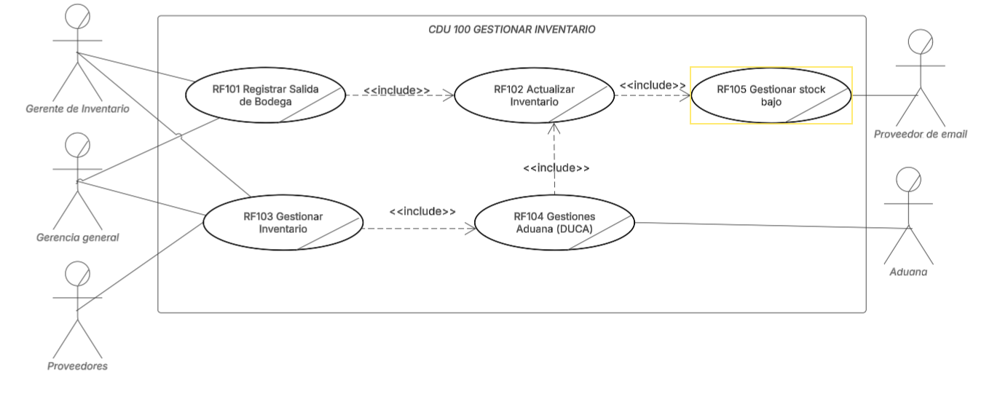

#### 3.1.1 Descripción de CDU 100 Gestionar Inventario
| **Campo**                  | **Descripción**                                                                                                                                                                                                                                                                                                                                                                                                                                                                                                                                                                                                                   |
| -------------------------- | --------------------------------------------------------------------------------------------------------------------------------------------------------------------------------------------------------------------------------------------------------------------------------------------------------------------------------------------------------------------------------------------------------------------------------------------------------------------------------------------------------------------------------------------------------------------------------------------------------------------------------- |
| **Nombre del caso de uso** | **CUN 100 Gestionar Inventario**                                                                                                                                                                                                                                                                                                                                                                                                                                                                                                                                                                                                  |
| **Actores**                | - **Gerencia General**: Encargado de la gestión del inventario. <br> - **Proveedores**: Involucrados en el proceso de abastecimiento. <br> - **Aduana**: Maneja los procesos aduaneros relacionados con los productos.       <br> - **Proveedres**: Entrega el producto.      <br> - **Gerente de Invenario**: Maneja el stock de los productos. <br> - **Proveedores de Email**: Envia la alerta de stock bajo.                                                                                                                                                                                                                                                                                                                                                                                                                                                                                                                                                                |
| **Propósito**              | Gestionar las entradas, salidas y actualización del inventario, asegurando que todos los productos estén correctamente registrados y disponibles en el sistema.                                                                                                                                                                                                                                                                                                                                                                                                                                                                   |
| **Resumen**                | El caso de uso **Gestionar Inventario** incluye el registro de productos que entran y salen del inventario, la actualización del mismo y las gestiones relacionadas con la aduana. Los actores realizan tareas específicas como registrar productos y gestionar el cumplimiento de las normativas aduaneras.                                                                                                                                                                                                                                                                                                                      |
| **Flujo de trabajo**       | **Flujo Básico (Normal):** <br> 1. El **Gerente General** registra la salida de productos de la bodega (**RF101 Registrar Salida de Bodega**). <br> 2. El sistema actualiza el inventario (**RF102 Actualizar Inventario**). <br> 3. El inventario es gestionado (**RF103 Gestionar Inventario**). <br> 4. La **Aduana** realiza gestiones aduaneras (**RF104 Gestiones Aduana (DUCA)**).                                                                                                                                                                                                                                                                                                                                                                                                                                                                                                    |
| **Mejoras**                | Integración con sistemas de trazabilidad en tiempo real para un mejor seguimiento de los productos.                                                                                                                                                                                                                                                                    |


### 3.2. CDU 200 Gestionar Datos

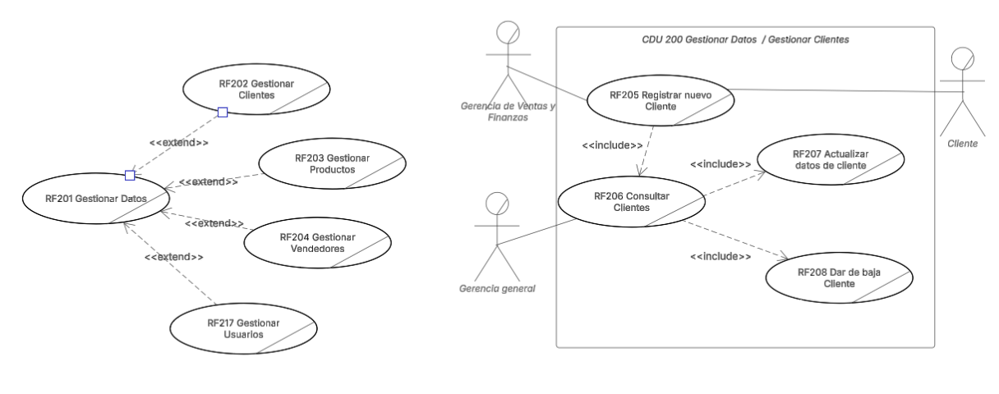
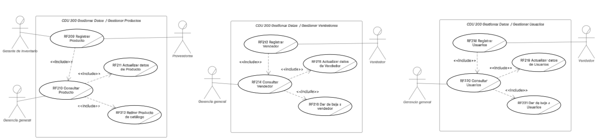
#### 3.2.1 Descripción de CDU 200 Gestionar Datos

| **Campo**                  | **Descripción**                                                                                                                                                                                                                                                                                                                                                                                                                                                                                  |
| -------------------------- | ------------------------------------------------------------------------------------------------------------------------------------------------------------------------------------------------------------------------------------------------------------------------------------------------------------------------------------------------------------------------------------------------------------------------------------------------------------------------------------------------ |
| **Nombre del caso de uso** | **CUN 200 Gestionar Datos**                                                                                                                                                                                                                                                                                                                                                                                                                                                                      |
| **Actores**                | - **Gerente General**: Encargado de gestionar los datos (clientes, productos, vendedores). <br> - **Cliente**: Interactúa con el sistema para registrar y consultar sus datos. <br> - **Proveedor**: Se encarga del registro de productos y actualización de su información. <br> - **Vendedor**: Registra y actualiza datos de los vendedores y consulta la información.     **Gerente de Inventario**: Maneja todos los productos de IMPORCOMGUA                                                                                                                  |
| **Propósito**              | Gestionar la información de clientes, productos y vendedores, permitiendo su registro, actualización y consulta de manera eficiente y organizada.                                                                                                                                                                                                                                                                                                                                                |
| **Resumen**                | El caso de uso **Gestionar Datos** se centra en tres áreas principales: <br> 1. **Clientes**: Involucra su registro, actualización y consulta. <br> 2. **Productos**: Gestión de los productos a través del registro, actualización y retiro. <br> 3. **Vendedores**: Registro de vendedores, actualización y gestión de bajas.                                                                                                                                                                  |
| **Flujo de trabajo**       | **Flujo Básico (Normal):** <br> 1. **Administrador** registra un nuevo **Cliente** (RF205). <br> 2. El **Administrador** actualiza la información del cliente (RF206). <br> 3. Se consulta el **Cliente** (RF207). <br> 4. El **Administrador** gestiona **Productos** (RF209) y **Vendedores** (RF213).  |
| **Prioridad**              | Alta, ya que gestionar los datos correctamente es crucial para el funcionamiento eficiente del sistema de gestión.                                                                                                                                                                                                                                                                                                                                                                               |
| **Mejoras**                | Integración con un sistema automatizado para la validación de datos y mejorar la interacción con el cliente en tiempo real.                                                                                                                                                                                                                                                                                                                                                                      |


### 3.3. CDU 300 Gestionar Ventas
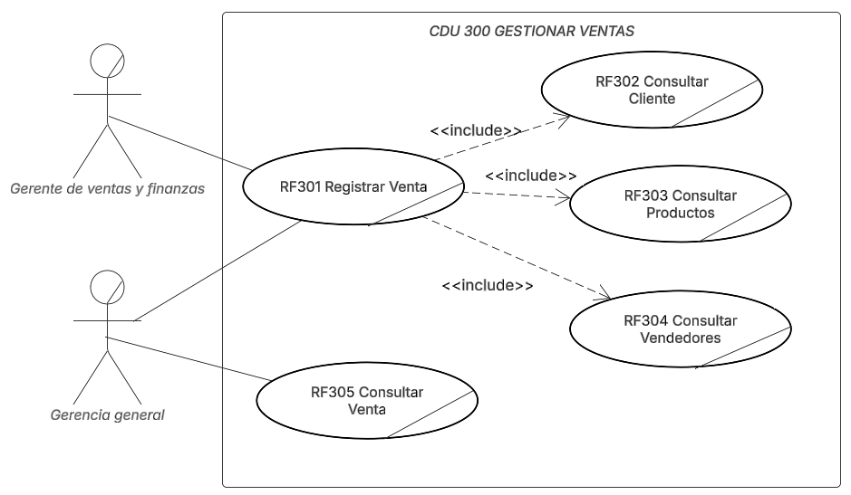

#### 3.3.1 Descripción de CDU 300 Gestionar Ventas
| **Campo**                  | **Descripción**                                                                                                                                                                                                                                                                                                                                                                                              |
| -------------------------- | ------------------------------------------------------------------------------------------------------------------------------------------------------------------------------------------------------------------------------------------------------------------------------------------------------------------------------------------------------------------------------------------------------------ |
| **Nombre del caso de uso** | **CUN 300 Gestionar Ventas**                                                                                                                                                                                                                                                                                                                                                                                 |
| **Actores**                | - **Gerente General**: Encargado de registrar y consultar las ventas.    <br>         -**Gerente de Ventas y finanzas**: Registra ventas                                                                                                                                                                                                                                                                                                                                                                                               |
| **Propósito**              | Registrar, consultar y gestionar las ventas dentro del sistema, interactuando con los datos de clientes, productos y vendedores.                                                                                                                                                                                                                                                                             |
| **Resumen**                | El caso de uso **Gestionar Ventas** cubre el proceso de registrar una venta, consultar los clientes, productos y vendedores asociados a cada transacción.                                                                                                                                                                                                                                                    |
| **Flujo de trabajo**       | **Flujo Básico (Normal):** <br> 1. El **Gerente General** registra una venta (RF301). <br> 2. El **Administrador** consulta los **clientes** (RF302). <br> 3. El **Gerente General** consulta los **productos** involucrados en la venta (RF303). <br> 4. El **Administrador** consulta los **vendedores** relacionados con la venta (RF304). <br> 5. El **Administrador** consulta la venta registrada (RF305). |
| **Prioridad**              | Alta, ya que el proceso de ventas es crucial para la operación del negocio.                                                                                                                                                                                                                                                                                                                                  |
| **Mejoras**                | Se podría integrar un sistema automatizado para recomendaciones de productos basados en ventas previas y optimización del proceso de facturación.                                                                                                                                                                                                                                                            |

### 3.4. CDU 400 Manejar Pagos
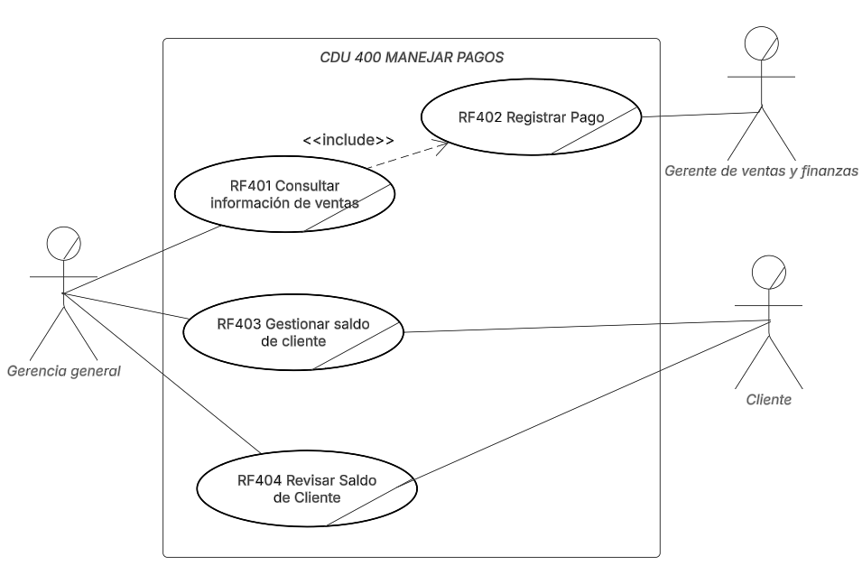

#### 3.4.1 Descripción de CDU 400 Manejar Pagos

| **Campo**                  | **Descripción**                                                                                                                                                                                                                                                                                                                                                                                                                                                                                        |
| -------------------------- | ------------------------------------------------------------------------------------------------------------------------------------------------------------------------------------------------------------------------------------------------------------------------------------------------------------------------------------------------------------------------------------------------------------------------------------------------------------------------------------------------------ |
| **Nombre del caso de uso** | **CUN 400 Manejar Pagos**                                                                                                                                                                                                                                                                                                                                                                                                                                                                              |
| **Actores**                | - **Gerente General**: Encargado de registrar pagos, consultar ventas y gestionar saldos de clientes. <br> - **Cliente**: Revisa su saldo y realiza pagos.             <br> - **Gerente de Ventas y Finanzas **: Registra los pagos.                                                                                                                                                                                                                                                                                                                                     |
| **Propósito**              | Gestionar el proceso de pagos, permitiendo el registro de pagos, consulta de ventas y gestión de saldos de los clientes.                                                                                                                                                                                                                                                                                                                                                                               |
| **Resumen**                | Este caso de uso se centra en el manejo de los pagos. El **Gerente de ventas y Fianzas** puede registrar pagos y gestionar los saldos de los clientes, mientras que los **Clientes** pueden consultar su saldo y realizar pagos.                                                                                                                                                                                                                                                                                     |
| **Flujo de trabajo**       | **Flujo Básico (Normal):** <br> 1. El **Gerente de ventas y Fianzas** consulta la información de la venta (RF401). <br> 2. El **Administrador** registra un pago (RF402). <br> 3. El **Gerente General** gestiona el saldo de los clientes (RF403). <br> 4. El **Cliente** revisa su saldo (RF404). <br>                                                                                                                                                                                                                                                                                                                     |
| **Mejoras**                | Integración con un sistema de pagos en línea y notificaciones automáticas de saldos y pagos realizados para mejorar la experiencia del cliente.                                                                                                                                                                                                                                                                                                                                                        |


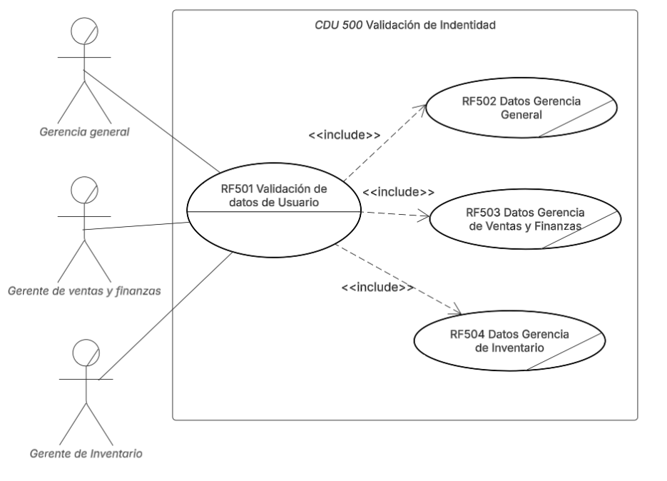

| **Nombre del caso de uso** | **CUN 500 Validación de Identidad**                                                                                   |
|----------------------------|------------------------------------------------------------------------------------------------------------------------|
| **Actores**                | - **Gerencia General** <br> - **Gerente de Ventas y Finanzas** <br> - **Gerente de Inventario**                         |
| **Propósito**              | Verificar la identidad del usuario y determinar su rol para habilitar el acceso a los datos correspondientes.          |
| **Resumen**                | El usuario ingresa sus credenciales (RF-501), el sistema valida su identidad y, según su rol, incluye RF-502, RF-503 o RF-504. |
| **Flujo de trabajo**       | **Flujo Básico:** <br> 1. El usuario introduce usuario y contraseña (RF-501). <br> 2. El sistema valida credenciales. <br> 3. Si es **Gerencia General**, carga RF-502; si es **Ventas y Finanzas**, carga RF-503; si es **Inventario**, carga RF-504. <br> 4. El usuario accede con los permisos adecuados. |
| **Mejoras**                | - Autenticación multifactor (2FA) <br> - Integración con un directorio corporativo (LDAP/AD)                             |


# Documentación Fase 1


## 4. Matrices de Trazabilidad

> [!NOTE]
>
> Los nombres de los casos de uso se encuentran en el diagrama CDU expandido.

### A. Stakeholders vs Requerimientos
|Requerimiento|Administrador|Vendedor|Cliente|
|:-:|:-:|:-:|:-:|
|RF 101|✅|||
|RF 102|✅|||
|RF 103||✅|✅|
|RF 104|✅|||
|RF 105|✅|||
|RF 106|✅|||
|RF 107|✅|||
|RF 108|✅|||
|RF 109|✅|||
|RF 201|✅||✅|
|RF 202|✅|✅||
|RF 203|✅|✅||
|RF 204|✅|||
|RF 205|✅|✅||
|RF 206|✅|✅||
|RF 207|✅|✅||
|RF 208|✅|||
|RF 209|✅|✅||
|RF 210|✅|✅||
|RF 211|✅|||
|RF 212|✅|||
|RF 301|✅|✅||
|RF 302|✅|||
|RF 303|✅|||
|RF 304|✅|||
|RF 305|✅|||
|RF 306|✅|||
|RF 401||✅||
|RF 402||✅||
|RF 403||✅||
|RF 404||✅||
|RF 405||✅||
|RF 406|||✅|

### B. Stakeholders vs Casos de Uso
|CDU/Stakeholders|Administrador|
|:-:|:-:|
|RF 101|✅|
|RF 102|✅|
|RF 103|✅|
|RF 104|✅|
|RF 105|✅|
|RF 106|✅|
|RF 107|✅|
|RF 108|✅|
|RF 109|✅|
|RF 201||
|RF 202||
|RF 203||
|RF 204||
|RF 205|✅|
|RF 206||
|RF 207|✅|
|RF 208|✅|
|RF 209|✅|
|RF 210|✅|
|RF 211|✅|
|RF 212|✅|
|RF 213|✅|
|RF 214|✅|
|RF 215|✅|
|RF 216|✅|
|RF 301|✅|
|RF 302|✅|
|RF 303|✅|
|RF 304|✅|
|RF 305|✅|
|RF 306|✅|
|RF 307|✅|
|RF 308|✅|
|RF 309|✅|
|RF 401|✅|
|RF 402|✅|
|RF 403|✅|
|RF 404|✅|
|RF 405|✅|
|RF 406|✅|

### C. Requerimientos vs Casos de uso
|Requerimiento/CDUs|CDU 1.0|CDU 2.1|CDU 2.2|CDU 2.3|CDU 3.0|CDU 4.0|
|:-:|:-:|:-:|:-:|:-:|:-:|:-:|
|RF 101|✅|
|RF 102|✅|
|RF 103|✅|
|RF 104|✅|
|RF 105|✅|
|RF 106|✅|
|RF 107|✅|
|RF 108|✅|
|RF 109|✅|
|RF 201||✅|||
|RF 202||✅|||
|RF 203||✅|||
|RF 204||✅|||
|RF 205|||✅||
|RF 206|||✅||
|RF 207|||✅||
|RF 208|||✅||
|RF 209||||✅|
|RF 210||||✅|
|RF 211||||✅|
|RF 212||||✅|
|RF 301|||||✅|
|RF 302|||||✅|
|RF 303|||||✅|
|RF 304|||||✅|
|RF 305|||||✅|
|RF 306|||||✅|
|RF 401||||||✅|
|RF 402||||||✅|
|RF 403||||||✅|
|RF 404||||||✅|
|RF 405||||||✅|
|RF 406||||||✅|

> [!NOTE]
>
> Los nombres de los casos de uso se encuentran en el diagrama CDU expandido.


# Documentación Fase 2


## 4. Matrices de Trazabilidad

> [!NOTE]
>
> Los nombres de los casos de uso se encuentran en el diagrama CDU expandido.

### A. Stakeholders vs Requerimientos
|Requerimiento|Administrador|Vendedor|Cliente|
|:-:|:-:|:-:|:-:|
|RF 101|✅|||
|RF 102|✅|||
|RF 103||✅|✅|
|RF 104|✅|||
|RF 105|✅|||
|RF 106|✅|||
|RF 107|✅|||
|RF 108|✅|||
|RF 109|✅|||
|RF 201|✅||✅|
|RF 202|✅|✅||
|RF 203|✅|✅||
|RF 204|✅|||
|RF 205|✅|✅||
|RF 206|✅|✅||
|RF 207|✅|✅||
|RF 208|✅|||
|RF 209|✅|✅||
|RF 210|✅|✅||
|RF 211|✅|||
|RF 212|✅|||
|RF 301|✅|✅||
|RF 302|✅|||
|RF 303|✅|||
|RF 304|✅|||
|RF 305|✅|||
|RF 306|✅|||
|RF 401||✅||
|RF 402||✅||
|RF 403||✅||
|RF 404||✅||
|RF 405||✅||
|RF 406|||✅|

### B. Stakeholders vs Casos de Uso
|CDU/Stakeholders|Administrador|
|:-:|:-:|
|RF 101|✅|
|RF 102|✅|
|RF 103|✅|
|RF 104|✅|
|RF 105|✅|
|RF 106|✅|
|RF 107|✅|
|RF 108|✅|
|RF 109|✅|
|RF 201||
|RF 202||
|RF 203||
|RF 204||
|RF 205|✅|
|RF 206||
|RF 207|✅|
|RF 208|✅|
|RF 209|✅|
|RF 210|✅|
|RF 211|✅|
|RF 212|✅|
|RF 213|✅|
|RF 214|✅|
|RF 215|✅|
|RF 216|✅|
|RF 301|✅|
|RF 302|✅|
|RF 303|✅|
|RF 304|✅|
|RF 305|✅|
|RF 306|✅|
|RF 307|✅|
|RF 308|✅|
|RF 309|✅|
|RF 401|✅|
|RF 402|✅|
|RF 403|✅|
|RF 404|✅|
|RF 405|✅|
|RF 406|✅|

### C. Requerimientos vs Casos de uso
|Requerimiento/CDUs|CDU 1.0|CDU 2.1|CDU 2.2|CDU 2.3|CDU 3.0|CDU 4.0|
|:-:|:-:|:-:|:-:|:-:|:-:|:-:|
|RF 101|✅|
|RF 102|✅|
|RF 103|✅|
|RF 104|✅|
|RF 105|✅|
|RF 106|✅|
|RF 107|✅|
|RF 108|✅|
|RF 109|✅|
|RF 201||✅|||
|RF 202||✅|||
|RF 203||✅|||
|RF 204||✅|||
|RF 205|||✅||
|RF 206|||✅||
|RF 207|||✅||
|RF 208|||✅||
|RF 209||||✅|
|RF 210||||✅|
|RF 211||||✅|
|RF 212||||✅|
|RF 301|||||✅|
|RF 302|||||✅|
|RF 303|||||✅|
|RF 304|||||✅|
|RF 305|||||✅|
|RF 306|||||✅|
|RF 401||||||✅|
|RF 402||||||✅|
|RF 403||||||✅|
|RF 404||||||✅|
|RF 405||||||✅|
|RF 406||||||✅|

> [!NOTE]
>
> Los nombres de los casos de uso se encuentran en el diagrama CDU expandido.

# Documentación Fase 3

## 4. Matrices de Trazabilidad

### A. Stakeholders vs Requerimientos

| Requerimiento  | Cliente | Vendedor | Proveedores | Proveedor de email | Gerente de Inventario | Gerencia General | Encargado de Bodega | Aduana | Gerente de Ventas y Finanzas |
|----------------|---------|----------|-------------|---------------------|-----------------------|------------------|---------------------|--------|-----------------------------|
| RF101          |         |          |             |                     | ✅                    | ✅                  | ✅                   |        |                             |
| RF102          |         |          |             |                     | ✅                    |                      |                     |        |                             |
| RF103          |         |          | ✅          |                     | ✅                    | ✅                  |                     |        |                             |
| RF104          |         |          |             |                     |                       |                     |                     | ✅     |                             |
| RF105          |         |          |             | ✅                  | ✅                    |                     |                     |        |                             |
| RF201          |         |          |             |                     |                       | ✅                  |                     |        |                             |
| RF202          | ✅      |          |             |                     |                       | ✅                  |                     |        |                             |
| RF203          |         |          | ✅          |                     |                       |                     |                     |        |                             |
| RF204          |         | ✅       |             |                     |                       |                     |                     |        |                             |
| RF205          | ✅      |          |             |                     |                       | ✅                |                     |        | ✅                           |
| RF206          | ✅      |          |             |                     |                       | ✅                |                     |        |                             |
| RF207          | ✅      |          |             |                     |                       | ✅                |                     |        |                             |
| RF208          | ✅      |          |             |                     |                       | ✅                |                     |        |                             |
| RF209          |         |          | ✅          |                     |                       |                       |                     |        |                             |
| RF210          |         |          | ✅          |                     |                       |                       |                     |        |                             |
| RF211          |         |          | ✅          |                     |                       |                       |                     |        |                             |
| RF212          |         |          | ✅          |                     |                       |                       |                     |        |                             |
| RF213          |         | ✅       |             |                     |                       |    ✅                   |                     |        |                             |
| RF214          |         | ✅       |             |                     |                       |                       |                     |        |                             |
| RF215          |         | ✅       |             |                     |                       |                       |                     |        |                             |
| RF216          |         | ✅       |             |                     |                       |                       |                     |        |                             |
| RF217          |         |          |             |                     |                       |                     | ✅                   |        |                             |
| RF218          |         |  ✅        |             |                     |                       | ✅                |                   |        |                             |
| RF219          |         |          |             |                     |                       | ✅                |                   |        |                             |
| RF220          |         |          |             |                     |                       | ✅                |                  |        |                             |
| RF221          |         |          |             |                     |                       | ✅                |                  |        |                             |
| RF301          |         |          |             |                     |                       |                     |                     |        | ✅                          |
| RF302          | ✅      |          |             |                     |                       | ✅                  |                     |        | ✅                          |
| RF303          |         |          | ✅          |                     |                       |                     |                     |        | ✅                          |
| RF304          |         | ✅       |             |                     |                       |                     |                     |        | ✅                          |
| RF305          |         |          |             |                     |                       | ✅                  |                     |        |                             |
| RF401          |         |          |             |                     |                       | ✅                  |                     |        |                             |
| RF402          |         |          |             |                     |                       |                     |                     |        | ✅                          |
| RF403          |         |          |             |                     |                       | ✅                  |                     |        |                             |
| RF404          | ✅      |          |             |                     |                       | ✅                  |                     |        |                             |
| RF500          |         |          |             |                     |                       | ✅                  |                     |        |                             |
| RF501          |         |          |             |                     | ✅                    | ✅                  |                     |        | ✅                          |
| RF502          |         |          |             |                     |                       | ✅                  |                     |        |                             |
| RF503          |         |          |             |                     |                       |                     |                     |        | ✅                          |
| RF504          |         |          |             |                     | ✅                    |                     |                     |        |                             |


### B. Stakeholders vs Casos de Uso

| Casos de usoah | Cliente | Vendedor | Proveedores | Proveedor de email | Gerente de Inventario | Gerencia General | Encargado de Bodega | Aduana | Gerente de Ventas y Finanzas |
|------------------|---------|----------|-------------|---------------------|-----------------------|------------------|---------------------|--------|-----------------------------|
| CUN 100 Gestionar Inventario |         |          |             | ✅                  | ✅                    | ✅               |                     | ✅     | ✅                          |
| CUN 200 Gestionar Datos      | ✅      | ✅       |             |                     | ✅                    | ✅               |                     |        | ✅                          |
| CUN 300 Gestionar Ventas     |         | ✅       |             |                     |                       | ✅               |                     |        | ✅                          |
| CUN 400 Manejar Pagos        | ✅      |          |             |                     |                       | ✅               |                     |        | ✅                          |
| CUN 500 Validación de Identidad |      |          |             |                     | ✅                    | ✅               |                     |        | ✅                          |

### C. Requerimientos vs Casos de uso

| Requerimiento/CDUs | CUN 100 Gestionar Inventario | CUN 200 Gestionar Datos | CUN 300 Gestionar Ventas | CUN 400 Manejar Pagos | CUN 500 Validación de Identidad |
|:------------------:|:-----------------------------:|:------------------------:|:-------------------------:|:----------------------:|:--------------------------------:|
| RF101              | ✅                            |                          |                           |                        |                                  |
| RF102              | ✅                            |                          |                           |                        |                                  |
| RF103              | ✅                            |                          |                           |                        |                                  |
| RF104              | ✅                            |                          |                           |                        |                                  |
| RF105              | ✅                            |                          |                           |                        |                                  |
| RF201              |                               | ✅                       |                           |                        |                                  |
| RF202              |                               | ✅                       |                           |                        |                                  |
| RF203              |                               | ✅                       |                           |                        |                                  |
| RF204              |                               | ✅                       |                           |                        |                                  |
| RF205              |                               | ✅                       |                           |                        |                                  |
| RF206              |                               | ✅                       |                           |                        |                                  |
| RF207              |                               | ✅                       |                           |                        |                                  |
| RF208              |                               | ✅                       |                           |                        |                                  |
| RF209              |                               | ✅                       |                           |                        |                                  |
| RF210              |                               | ✅                       |                           |                        |                                  |
| RF211              |                               | ✅                       |                           |                        |                                  |
| RF212              |                               | ✅                       |                           |                        |                                  |
| RF213              |                               | ✅                       |                           |                        |                                  |
| RF214              |                               | ✅                       |                           |                        |                                  |
| RF215              |                               | ✅                       |                           |                        |                                  |
| RF216              |                               | ✅                       |                           |                        |                                  |
| RF217              |                               | ✅                       |                           |                        |                                  |
| RF218              |                               | ✅                       |                           |                        |                                  |
| RF219              |                               | ✅                       |                           |                        |                                  |
| RF220              |                               | ✅                       |                           |                        |                                  |
| RF221              |                               | ✅                       |                           |                        |                                  |
| RF301              |                               |                          | ✅                        |                        |                                  |
| RF302              |                               |                          | ✅                        |                        |                                  |
| RF303              |                               |                          | ✅                        |                        |                                  |
| RF304              |                               |                          | ✅                        |                        |                                  |
| RF305              |                               |                          | ✅                        |                        |                                  |
| RF401              |                               |                          |                           | ✅                     |                                  |
| RF402              |                               |                          |                           | ✅                     |                                  |
| RF403              |                               |                          |                           | ✅                     |                                  |
| RF404              |                               |                          |                           | ✅                     |                                  |
| RF500              |                               |                          |                           |                        | ✅                               |
| RF501              |                               |                          |                           |                        | ✅                               |
| RF502              |                               |                          |                           |                        | ✅                               |
| RF503              |                               |                          |                           |                        | ✅                               |
| RF504              |                               |                          |                           |                        | ✅                               |

> [!NOTE]
>
> Los nombres de los casos de uso se encuentran en el diagrama CDU expandido.


# Documentación Fase 1

## 5. Identificación de estructuras arquitectónicas y selección del o los estilos arquitectónicos y la razón de su elección.

Como equipo de desarrollo, decidimos implementar el estilo arquitectónico cliente-servidor porque se alinea con las necesidades funcionales y técnicas de nuestro sistema. Uno de los factores clave que nos llevó a esta elección es que los usuarios acceden al sistema desde distintos dispositivos conectados a la red —como computadoras portátiles o móviles— y necesitan una interfaz clara y accesible que les permita interactuar con los módulos del sistema, sin preocuparse por la complejidad interna del mismo.

En esta arquitectura, la responsabilidad se divide claramente: el cliente se encarga de la presentación y la interacción con el usuario, mientras que el servidor concentra toda la lógica de negocio y el acceso a los datos. Esto lo reflejamos en nuestros diagramas, donde los usuarios se comunican con la capa de aplicación mediante HTTP, mientras que el servidor de aplicación se comunica con la base de datos SQL Server utilizando TCP/IP. De esta manera, conseguimos centralizar el procesamiento y mantener una estructura más controlada y segura.

Además, este estilo nos permite escalar o modificar el sistema sin afectar a todos los componentes. Por ejemplo, si deseamos actualizar el módulo de “Gestión de inventario”, podemos hacerlo directamente en el servidor sin necesidad de tocar el cliente. Esta separación nos facilita el mantenimiento, la evolución del sistema y el manejo de múltiples usuarios simultáneamente.

También consideramos que este enfoque permite una mejor integración con servicios externos, como APIs, lo cual es evidente en nuestra arquitectura actual. Todo esto nos lleva a concluir que el modelo cliente-servidor no solo es el más natural para la forma en que el sistema será utilizado, sino también el más robusto y escalable para el tipo de solución que estamos construyendo.


# Documentación Fase 2


## 5. Identificación de estructuras arquitectónicas y selección del o los estilos arquitectónicos y la razón de su elección.

**ARQUITECTURA EN CAPAS (REACT + FLASK + MYSQL)**

**1. Capa de Presentación** – Frontend (React.js)

El motivo de esta selección responde a la neesidad de mostrar una interfaz web responsiva, amigable y rápida, donde sea posible validar entradas del usuario antes de enviarlas al backend, así como consumir APIs RESTful expuestas por Flask, manejar autenticación y sesiones.

**2. Capa de Lógica de Negocio** – Backend (Python + Flask)

El motivo de esta selección responde a la necesidad de procesar toda la lógica del negocio: ventas, inventario, pagos, comisiones, control de usuarios, así como validar reglas antes de interactuar con la base de datos, gestionar sesiones y control de acceso; y exponer APIs REST para el frontend.

**3. Capa de Persistencia** – Base de Datos (MySQL)

El motivo de esta selección responde a la necesidad de almacenar y consultar toda la información del sistema (clientes, ventas, inventario, pagos, historial), relacionar correctamente las entidades con claves foráneas, garantizar integridad referencial, optimizar consultas con índices y vistas.


# Documentación Fase 3


## 5. Identificación de estructuras arquitectónicas y selección del o los estilos arquitectónicos y la razón de su elección.

**ARQUITECTURA EN CAPAS (REACT + FLASK + MYSQL)**

**1. Capa de Presentación** – Frontend (React.js)

El motivo de esta selección responde a la neesidad de mostrar una interfaz web responsiva, amigable y rápida, donde sea posible validar entradas del usuario antes de enviarlas al backend, así como consumir APIs RESTful expuestas por Flask, manejar autenticación y sesiones.

**2. Capa de Lógica de Negocio** – Backend (Python + Flask)

El motivo de esta selección responde a la necesidad de procesar toda la lógica del negocio: ventas, inventario, pagos, comisiones, control de usuarios, así como validar reglas antes de interactuar con la base de datos, gestionar sesiones y control de acceso; y exponer APIs REST para el frontend.

**3. Capa de Persistencia** – Base de Datos (MySQL)

El motivo de esta selección responde a la necesidad de almacenar y consultar toda la información del sistema (clientes, ventas, inventario, pagos, historial), relacionar correctamente las entidades con claves foráneas, garantizar integridad referencial, optimizar consultas con índices y vistas.

**4. Capa de Integración** – Sendgrid

El motivo de la utilización de Sendgrid en una capa de integración ofrece múltiples beneficios, incluyendo una mayor fiabilidad y escalabilidad en el envío de correos electrónicos, una gestión más sencilla de la infraestructura de correo, y acceso a herramientas de análisis para mejorar la efectividad de las campañas. SendGrid facilita la integración con diversas aplicaciones y plataformas, permitiendo una comunicación fluida con usuarios y clientes. 


# Documentación Fase 1

## 6. Diagrama de bloques que represente la arquitectura implementada

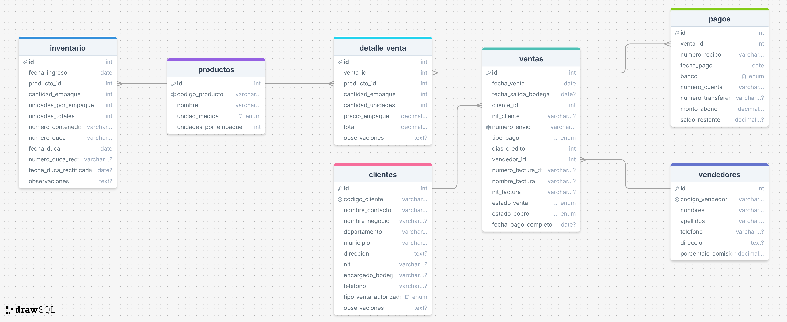


# Documentación Fase 2

## 6. Diagrama de bloques que represente la arquitectura implementada


## Documentación Fase 3 

## 6. Diagrama de bloques que represente la arquitectura implementada

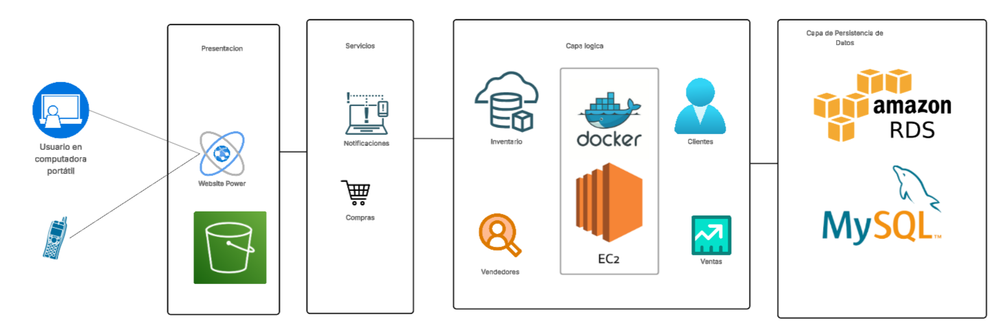


# Documentación Fase 1

## 7. Diagrama de Despliegue


# Documentación Fase 2


## 7. Diagrama de Despliegue


# Documentación Fase 3


## 7.0 Diagrama de Distribución

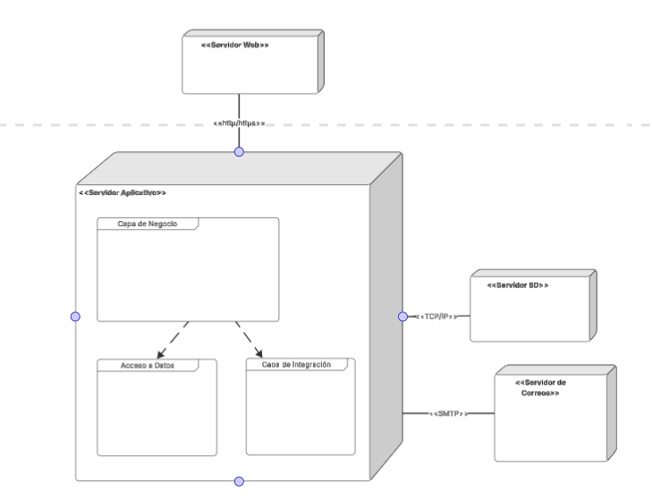


## 7.1 Diagrama de Componentes

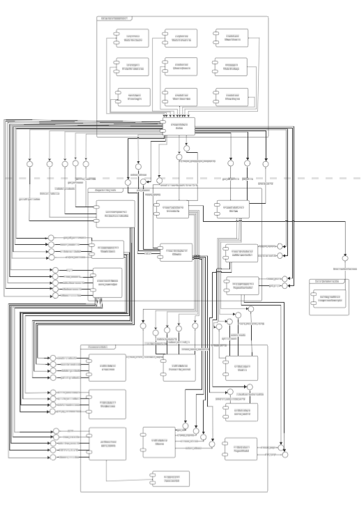

https://lucid.app/lucidchart/1459b10f-6400-4fe9-bff8-9906a5191a34/edit?page=.Q4MUjXso07N&invitationId=inv_3d0f273c-1e95-4199-9a21-71b864a9b80a#

## 7.2 Diagrama de Despliegue

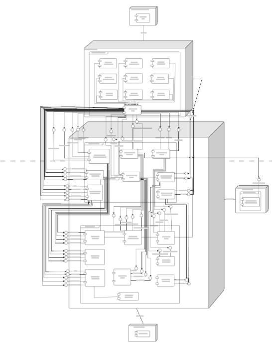

https://lucid.app/lucidchart/1459b10f-6400-4fe9-bff8-9906a5191a34/edit?page=.Q4MUjXso07N&invitationId=inv_3d0f273c-1e95-4199-9a21-71b864a9b80a#


# Documentación Fase 1

## 8. Diagrama Entidad Relación


https://lucid.app/lucidchart/1459b10f-6400-4fe9-bff8-9906a5191a34/edit?page=.Q4MUjXso07N&invitationId=inv_3d0f273c-1e95-4199-9a21-71b864a9b80a# 

# Documentación Fase 2


## 8. Diagrama Entidad Relación


# Documentación Fase 3


## 8. Diagrama Entidad Relación
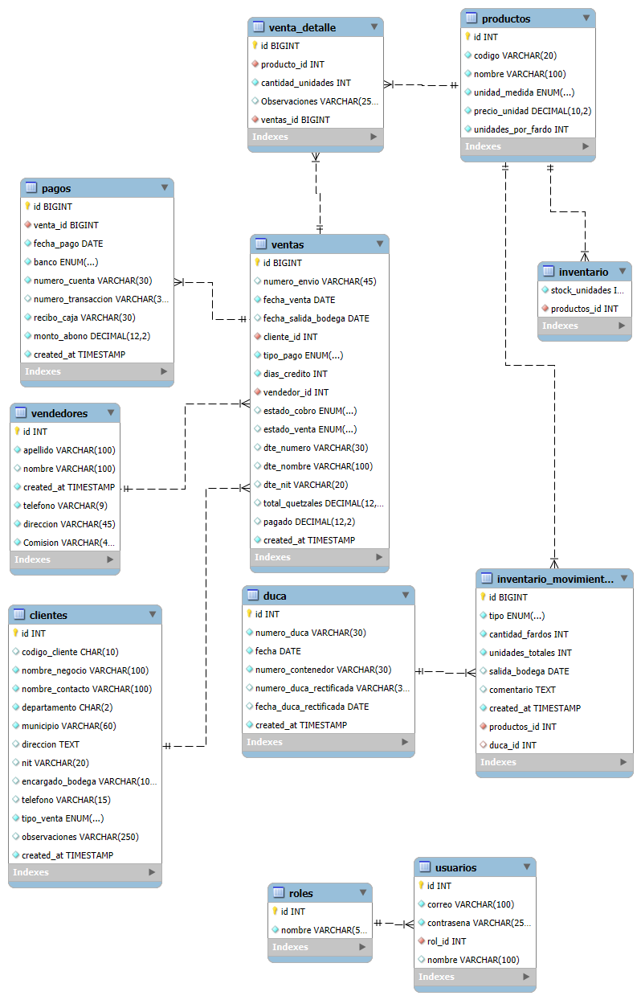


# Documentación Fase 1

## 9. Prototipos

Los prototipos de interfaz presentados a continuación fueron diseñados aplicando principios de usabilidad y accesibilidad, con el objetivo de facilitar la interacción del usuario con las diferentes funcionalidades del sistema IMPORCOMGUA. Cada prototipo se centra en proporcionar una experiencia intuitiva y eficiente para los procesos operativos clave de la empresa.

### 9.1 Clientes


**Funcionalidades principales:**
- Validación de campos obligatorios y opcionales
- Selección dinámica de municipios según departamento
- Configuración de tipos de venta (Crédito/Contado/Ambas)

### 9.2 Productos


**Funcionalidades principales:**
- Configuración de unidades de medida (Unidad/Fardo/Paquete)
- Definición de unidades por fardo/paquete para cálculos automáticos
- Validación de campos obligatorios

### 9.3 Vendedores


**Funcionalidades principales:**
- Registro de información personal y de contacto
- Configuración de porcentaje de comisión personalizado
- Validación de formato de teléfono

### 9.4 Registrar Salida


**Funcionalidades principales:**
- Búsqueda de ventas por número de envío o cliente
- Visualización completa de información de venta
- Registro de fecha de salida de bodega

### 9.5 Regstrar pagos


**Funcionalidades principales:**
- Búsqueda de ventas por número de envío o cliente
- Registro de pagos con múltiples bancos (Industrial/Banrural/G&T/BAM)

### 9.6 Registrar Nueva venta


**Funcionalidades principales:**
- Selección de cliente con recuperación automática de datos fiscales
- Configuración de términos de pago (Contado/Crédito) con días de crédito
- Registro múltiple de productos
- Generación automática de cantidades en unidades

### 9.7 Ingresar Inventario


**Funcionalidades principales:**
- Registro automático de fecha de ingreso (modificable)
- Selección de productos con recuperación automática de configuraciones
- Registro de información aduanera (No. Contenedor, DUCA)
- Campos para observaciones adicionales


# Documentación Fase 2


## 9. Prototipos

Los prototipos de interfaz presentados a continuación fueron diseñados aplicando principios de usabilidad y accesibilidad, con el objetivo de facilitar la interacción del usuario con las diferentes funcionalidades del sistema IMPORCOMGUA. Cada prototipo se centra en proporcionar una experiencia intuitiva y eficiente para los procesos operativos clave de la empresa.

### 9.1 Clientes


**Funcionalidades principales:**
- Validación de campos obligatorios y opcionales
- Selección dinámica de municipios según departamento
- Configuración de tipos de venta (Crédito/Contado/Ambas)

### 9.2 Productos


**Funcionalidades principales:**
- Configuración de unidades de medida (Unidad/Fardo/Paquete)
- Definición de unidades por fardo/paquete para cálculos automáticos
- Validación de campos obligatorios

### 9.3 Vendedores


**Funcionalidades principales:**
- Registro de información personal y de contacto
- Configuración de porcentaje de comisión personalizado
- Validación de formato de teléfono

### 9.4 Registrar Salida


**Funcionalidades principales:**
- Búsqueda de ventas por número de envío o cliente
- Visualización completa de información de venta
- Registro de fecha de salida de bodega

### 9.5 Regstrar pagos


**Funcionalidades principales:**
- Búsqueda de ventas por número de envío o cliente
- Registro de pagos con múltiples bancos (Industrial/Banrural/G&T/BAM)
- Mostrar al usuario:
  - Días de créditos restantes
  - Total a pagar
  - El monto ya pagado
  - El saldo pendiente a pagar

### 9.6 Registrar Nueva venta


**Funcionalidades principales:**
- Selección de cliente con recuperación automática de datos fiscales
- Configuración de términos de pago (Contado/Crédito) con días de crédito
- Registro múltiple de productos
- Generación automática de cantidades en unidades

### 9.7 Recepción de Mercancía


**Funcionalidades principales:**
- Registro automático de fecha de ingreso (modificable)
- Selección de productos con recuperación automática de configuraciones
- Registro de información aduanera (No. Contenedor, DUCA)
- Campos para observaciones adicionales


# Documentación Fase 3


## 9. Prototipos

Los prototipos de interfaz presentados a continuación fueron diseñados aplicando principios de usabilidad y accesibilidad, con el objetivo de facilitar la interacción del usuario con las diferentes funcionalidades del sistema IMPORCOMGUA. Cada prototipo se centra en proporcionar una experiencia intuitiva y eficiente para los procesos operativos clave de la empresa.

### 9.1 Clientes


**Funcionalidades principales:**
- Validación de campos obligatorios y opcionales
- Selección dinámica de municipios según departamento
- Configuración de tipos de venta (Crédito/Contado/Ambas)

### 9.2 Productos


**Funcionalidades principales:**
- Configuración de unidades de medida (Unidad/Fardo/Paquete)
- Definición de unidades por fardo/paquete para cálculos automáticos
- Validación de campos obligatorios

### 9.3 Vendedores


**Funcionalidades principales:**
- Registro de información personal y de contacto
- Configuración de porcentaje de comisión personalizado
- Validación de formato de teléfono

### 9.4 Registrar Salida


**Funcionalidades principales:**
- Búsqueda de ventas por número de envío o cliente
- Visualización completa de información de venta
- Registro de fecha de salida de bodega

### 9.5 Regstrar pagos


**Funcionalidades principales:**
- Búsqueda de ventas por número de envío o cliente
- Registro de pagos con múltiples bancos (Industrial/Banrural/G&T/BAM)
- Mostrar al usuario:
  - Días de créditos restantes
  - Total a pagar
  - El monto ya pagado
  - El saldo pendiente a pagar

### 9.6 Registrar Nueva venta


**Funcionalidades principales:**
- Selección de cliente con recuperación automática de datos fiscales
- Configuración de términos de pago (Contado/Crédito) con días de crédito
- Registro múltiple de productos
- Generación automática de cantidades en unidades

### 9.7 Recepción de Mercancía


**Funcionalidades principales:**
- Registro automático de fecha de ingreso (modificable)
- Selección de productos con recuperación automática de configuraciones
- Registro de información aduanera (No. Contenedor, DUCA)
- Campos para observaciones adicionales


### 9.8 Login 


- Se inicia sesión si las credenciales son correctas.


### 9.9 Gestión Usuarios 

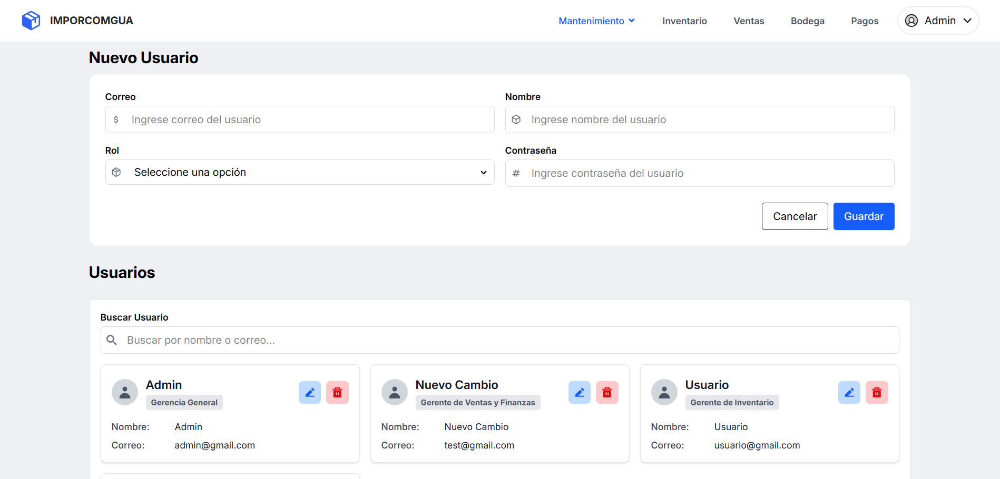

- Se crea, modifica y elimina un usuario.

# Documentación Fase 1

https://trello.com/invite/b/6848d8b34f62ec9b0b2df06d/ATTI486dda9bfe069d4d8850c3d784877eebF8C22A4B/kanban-template


# Documentación Fase 2

## 10. Tablero de Kanban/Trello
https://trello.com/invite/b/6848d8b34f62ec9b0b2df06d/ATTI486dda9bfe069d4d8850c3d784877eebF8C22A4B/kanban-template


## 11. Elección de Frameworks

| Framework      | Uso                                                                                           | Razón de Elección                                                                                   |
|----------------|------------------------------------------------------------------------------------------------|-----------------------------------------------------------------------------------------------------|
| **Flask**      | Backend                                                                                       | Sencillo, flexible y fácil de usar para crear APIs rápidas y eficientes sin la necesidad de complejidad. |
| **Vite-React** | Frontend                                                                                      | Optimiza tiempos de carga y ofrece recarga en caliente, acelerando el desarrollo en **React**.         |
| **Tailwind CSS** | Diseño de interfaz de usuario                                                                  | Permite construir interfaces modernas, personalizadas y responsivas rápidamente sin escribir CSS complejo.   |
| **Node.js**    | Backend (intermediario fronted)                                                                  | Potente para aplicaciones en tiempo real y con alta concurrencia, ideal para manejar múltiples conexiones simultáneas. |


# Documentación Fase 3

## 10. Tablero de Kanban/Trello

https://trello.com/b/JeWJP5vb/fase-iii-grupo-1-sprint-24-6-27-6 


## 11. Elección de Frameworks

| Framework      | Uso                                                                                           | Razón de Elección                                                                                   |
|----------------|------------------------------------------------------------------------------------------------|-----------------------------------------------------------------------------------------------------|
| **Flask**      | Backend                                                                                       | Sencillo, flexible y fácil de usar para crear APIs rápidas y eficientes sin la necesidad de complejidad. |
| **Vite-React** | Frontend                                                                                      | Optimiza tiempos de carga y ofrece recarga en caliente, acelerando el desarrollo en **React**.         |
| **Tailwind CSS** | Diseño de interfaz de usuario                                                                  | Permite construir interfaces modernas, personalizadas y responsivas rápidamente sin escribir CSS complejo.   |
| **Node.js**    | Backend (intermediario fronted)                                                                  | Potente para aplicaciones en tiempo real y con alta concurrencia, ideal para manejar múltiples conexiones simultáneas. |


# 12. Pruebas Unitarias
## Pruebas Unitarias

Las pruebas unitarias son fragmentos de código que verifican que funciones o métodos específicos del sistema funcionen correctamente de forma aislada. Su objetivo es asegurar que cada unidad mínima de funcionalidad (por ejemplo, una función) cumpla con los requisitos esperados.

**Importancia de las pruebas unitarias:**
- Permiten detectar errores de manera temprana, antes de que el software llegue a producción.
- Facilitan el mantenimiento, ya que al modificar el código, las pruebas ayudan a comprobar que no se haya roto ninguna funcionalidad existente.
- Documentan el comportamiento esperado de cada parte del sistema.

**¿Cómo funcionan?**
Cada función de prueba utiliza `assert` para comparar el resultado real de una función con el resultado esperado. Si la condición no se cumple, la prueba falla y muestra un mensaje de error.

**Ejemplos de pruebas implementadas:**
- `test_nit_exacto_7_digitos`: Verifica que el NIT tenga exactamente 7 dígitos.
- `test_telefono_exacto_8_digitos` y `test_telefono_exacto_8_digitos_funcion`: Comprueban que el teléfono tenga exactamente 8 dígitos.
- `test_fecha_formato_correcto`: Valida que la fecha tenga el formato correcto (YYYY-MM-DD, 10 caracteres).
- `test_contenedor_es_numero`: Verifica que el número de contenedor sea numérico.

Estas pruebas ayudan a garantizar que los datos ingresados cumplen con los requisitos del sistema y permiten detectar automáticamente cualquier validación que falle.

# 13. Pruebas de Integración

Las pruebas de integración son un nivel de prueba que se centra en la interacción entre diferentes módulos o componentes del sistema. Su objetivo es identificar problemas en la comunicación y el intercambio de datos entre estas partes.

**Importancia de las pruebas de integración:**
- Detectan errores que pueden surgir cuando los módulos interactúan entre sí, lo que no se puede capturar en pruebas unitarias.
- Aseguran que los flujos de trabajo completos funcionen como se espera, desde el inicio hasta el final.
- Validan que las interfaces entre componentes sean correctas y que los datos se transfieran adecuadamente.

**¿Cómo funcionan?**
Las pruebas de integración suelen implicar la configuración de un entorno de prueba que simula el entorno de producción. Esto puede incluir bases de datos, servicios externos y otros componentes del sistema. Las pruebas se ejecutan para verificar que los módulos interactúan correctamente y que el sistema en su conjunto cumple con los requisitos.

Estas pruebas de integración verifican cómo interactúan diferentes partes de tu aplicación (por ejemplo, rutas, servicios y respuestas HTTP) al trabajar juntas. Aquí tienes una explicación de cada prueba:

---

### 1. `test_create_producto_success`
- **Propósito:** Verifica que la API puede crear un producto correctamente.
- **Cómo funciona:** 
  - Usa `patch` para simular el método `create` del servicio de productos, devolviendo un producto ficticio.
  - Envía una petición POST a `/api/InsertarProducto` con datos de ejemplo.
  - Comprueba que la respuesta es 200 (éxito) y que el nombre del producto en la respuesta es correcto.

---

### 2. `test_get_producto_found`
- **Propósito:** Comprueba que la API devuelve un producto existente.
- **Cómo funciona:**
  - Simula el método `get_producto` para devolver un producto ficticio.
  - Envía una petición GET a `/api/GetProducto/1`.
  - Verifica que la respuesta es 200 y que el ID del producto es el esperado.

---

### 3. `test_get_producto_not_found`
- **Propósito:** Asegura que la API responde correctamente cuando el producto no existe.
- **Cómo funciona:**
  - Simula que `get_producto` devuelve `None` (producto no encontrado).
  - Envía una petición GET a `/api/GetProducto/999`.
  - Verifica que la respuesta es 404 y que el mensaje de error es el adecuado.

---

**Puntos clave:**
- Estas pruebas usan mocks para aislar la lógica de negocio y evitar dependencias externas (como bases de datos reales).
- Evalúan la integración entre las rutas de la API y los servicios, asegurando que la aplicación responde correctamente ante diferentes escenarios.
- Son útiles para detectar errores en la comunicación entre componentes, que no se ven en pruebas unitarias.

# 14. Pruebas de Aceptación
Las pruebas de aceptación son un tipo de prueba que se centra en validar si el sistema cumple con los requisitos y expectativas del cliente o usuario final. Estas pruebas se realizan generalmente al final del ciclo de desarrollo y tienen como objetivo asegurar que el software es apto para su uso.

**Importancia de las pruebas de aceptación:**
- Validan que el sistema cumple con los requisitos funcionales y no funcionales especificados.
- Aseguran que el software es usable y cumple con las expectativas del usuario final.
- Proporcionan una última línea de defensa antes de que el software se entregue al cliente o se implemente en producción.

**¿Cómo funcionan?**
Las pruebas de aceptación suelen implicar la ejecución de casos de prueba que simulan escenarios del mundo real. Estas pruebas pueden ser manuales o automatizadas y se centran en verificar que el sistema funciona como se espera en situaciones reales de uso.

### Ejemplo de pruebas de aceptación

A continuación se presenta una prueba de aceptación automatizada que valida el flujo completo de autenticación de usuarios en el sistema IMPORCOMGUA:

```python
from selenium import webdriver
from selenium.webdriver.chrome.service import Service
from selenium.webdriver.common.by import By
from selenium.webdriver.common.keys import Keys
import time

# Ruta al ChromeDriver
PATH = '/Users/sebas/Documents/Vacas de junio/AYD2_V1S2025_PROYECTO_G1/backend/tests_imporcomgua/chromedriver'
service = Service(PATH)
driver = webdriver.Chrome(service=service)

# Abre la página de login
driver.get("http://localhost:5173/")

# Esperar a que se renderice la página (puedes mejorar esto con WebDriverWait)
time.sleep(2)

# Encontrar campo de correo por el atributo 'placeholder'
email_input = driver.find_element(By.XPATH, "//input[@placeholder='usuario@correo.com']")
email_input.clear()
email_input.send_keys("admin@gmail.com")

# Encontrar campo de contraseña por el atributo 'placeholder'
password_input = driver.find_element(By.XPATH, "//input[@placeholder='********']")
password_input.clear()
password_input.send_keys("admin123")

# Enviar el formulario simulando Enter o dando clic al botón
password_input.send_keys(Keys.ENTER)

# Esperar un momento para ver el resultado
time.sleep(5)

# Validar si redirigió a la ruta esperada (ej. /inventario para admin)
assert "/inventario" in driver.current_url or "/ventas" in driver.current_url, "Login falló o no redirigió correctamente"

print("Login exitoso y redirección correcta")

# Cierra el navegador
driver.quit()
```

### Explicación de la prueba de aceptación:

**Objetivo:** Validar que un usuario administrador puede iniciar sesión correctamente en el sistema y ser redirigido a la página apropiada según su rol.

**Flujo de la prueba:**

1. **Configuración del entorno:**
   - Inicializa el navegador Chrome con ChromeDriver
   - Navega a la página principal del sistema (http://localhost:5173/)

2. **Interacción con la interfaz de usuario:**
   - Localiza el campo de correo electrónico usando su placeholder "usuario@correo.com"
   - Ingresa las credenciales de administrador: "admin@gmail.com"
   - Localiza el campo de contraseña usando su placeholder "********"
   - Ingresa la contraseña: "admin123"

3. **Ejecución de la acción:**
   - Envía el formulario presionando la tecla Enter
   - Simula el comportamiento real de un usuario

4. **Validación del resultado:**
   - Verifica que la URL actual contenga "/inventario" o "/ventas"
   - Confirma que la redirección se realizó correctamente según el rol del usuario
   - Utiliza assertion para garantizar que el login fue exitoso

5. **Limpieza:**
   - Cierra el navegador automáticamente

**Criterios de aceptación validados:**
- El sistema acepta credenciales válidas
- La autenticación funciona correctamente  
- La redirección se realiza según el rol del usuario (administrador → inventario/ventas)
- La interfaz de usuario responde adecuadamente a las interacciones

**Importancia de esta prueba:**
- Valida el flujo crítico de autenticación del sistema
- Simula el comportamiento real de un usuario final
- Verifica la integración completa entre frontend, backend y base de datos
- Asegura que los roles y permisos funcionan correctamente

Esta prueba representa un escenario de uso real donde un administrador accede al sistema para realizar sus tareas diarias de gestión de inventario o ventas.
