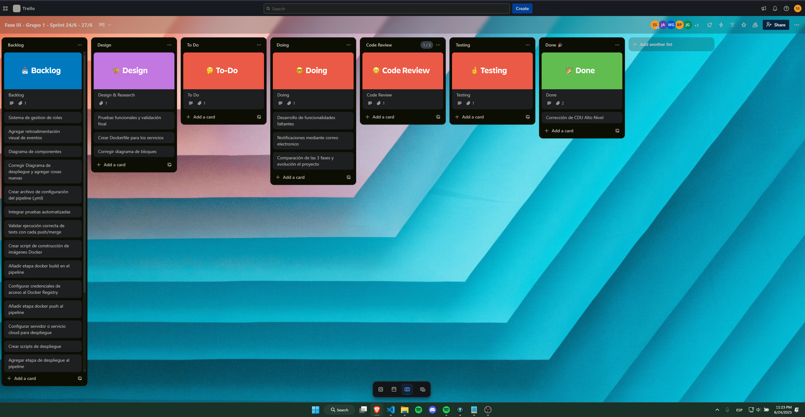

[Grabación - Daily 24 de Junio](https://drive.google.com/file/d/1vSTIUxcWIVikndrXEJ5UpdtOsvaZbGDv/view?usp=sharing)

## Transcripción de la reunión

### Participantes y actividades

| Nombre      | Ayer                                                                 | Hoy                                                                                  | Problemas         |
|-------------|----------------------------------------------------------------------|--------------------------------------------------------------------------------------|-------------------|
| Brandon     | Realizó un estudio para identificar proveedor de nube para desplegar. | Creará las imágenes de Docker.                                                       | Ninguno           |
| Joab        | Identificó los puntos faltantes de la fase anterior.                  | Continuará con funcionalidades pendientes.                                           | Ninguno           |
| Jose        | Investigó correcciones para el diagrama de bloques.                   | Aplicará las correcciones.                                                           | Ninguno           |
| Luis René   | Verificó la documentación para los cambios.                           | Realizará estudio sobre testing, acoplamiento y comparación de fases.                | Ninguno           |
| William     | Investigó sobre la funcionalidad de envío de correos.                 | Empezará a probar la herramienta SendGrid.                                           | Ninguno           |
| Sebas       | Identificó correcciones de la fase anterior en documentación.         | Empezó a escoger funciones para las pruebas.                                         | Ninguno           |

## Tablero Kanban
