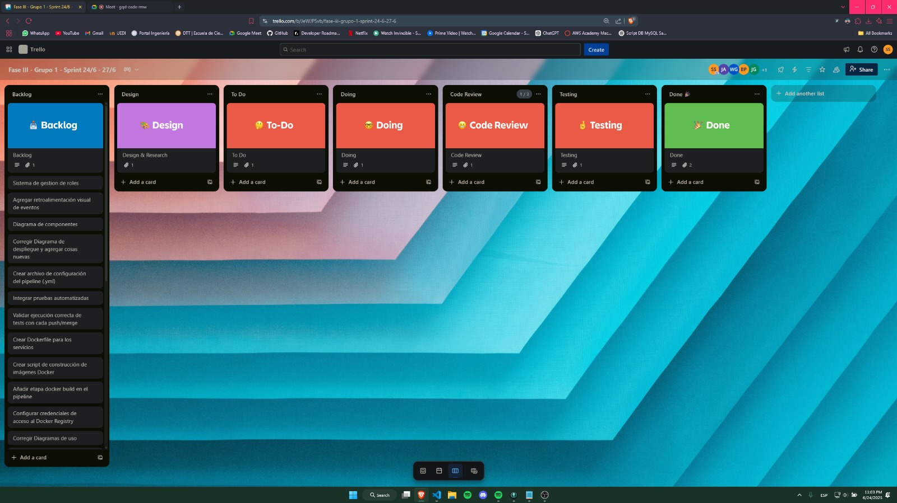

# Sprint Planning 24-27

## Resumen de tareas asignadas

- **Sistema de gestión de roles (permisos):** Joab  
- **Notificaciones por correo electrónico (stock):** Willy  
- **Funcionalidades restantes:** Joab  
- **Pruebas funcionales y validación final:** Sebas y Luis René  
- **Configuración de pipeline (CI/CD):** Brandon y Jose  
- **Despliegue en la nube:** Brandon y Jose  
- **Corrección de CDUs y nuevos casos:** Willy  
- **Corrección de diagrama de bloques:** Jose  
- **Pop ups de éxito:** Joab  
- **Diagrama de despliegue:** Joab, Sebas y Luis René  
- **Diagrama de componentes:** Joab, Sebas y Luis René  
- **Corrección de matrices y nuevas funcionalidades:** Willy  
- **Comparación de fases y evolución:** Luis René  

---

## Feedback de los integrantes

**Joab Ajsinivac:**  
Me parece interesante el reto de implementar el sistema de roles, sobre todo por la seguridad y trazabilidad que requiere. También veo útil agregar los pop ups de éxito, creo que mejorarán la experiencia del usuario. Estoy listo para avanzar con estas tareas.

**William Mazariegos:**  
La integración de notificaciones por correo es clave para la gestión de inventario, así que pondré especial atención en evitar notificaciones duplicadas. También revisaré los CDUs y matrices para que todo quede alineado con los cambios de esta fase.

**Brandon Tejaxán:**  
Configurar el pipeline y el despliegue en la nube es algo que ya hemos hecho antes, pero ahora buscaremos optimizarlo y documentarlo mejor. Trabajaré junto a Jose para que el proceso sea lo más fluido posible.

**Jose Hinestroza:**  
Voy a enfocarme en el pipeline y en corregir el diagrama de bloques. Me aseguraré de que todo esté bien documentado y que los diagramas reflejen los cambios recientes.

**Luis René Yaquián:**  
Me encargaré de la validación final y de comparar la evolución del proyecto en las tres fases. Creo que es importante resaltar cómo hemos mejorado y qué aprendizajes nos llevamos.

**Sebastian Godoy (Scrum Master):**  
Asigné las tareas pensando en las fortalezas de cada uno. Confío en que el equipo puede cumplir con los objetivos de este sprint y mantener la calidad del proyecto.

---  

